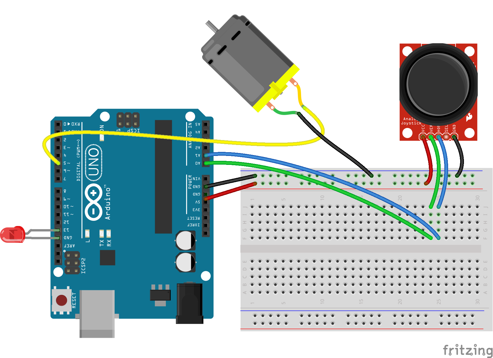

# Joystick Motor Led

Run with:
```bash
node eg/joystick-motor-led.js
```


```javascript
var five = require("johnny-five"),
    board, joystick, motor, led;

board = new five.Board();

board.on("ready", function() {

  // Create a new `joystick` hardware instance.
  joystick = new five.Joystick({
    // Joystick pins are an array of pins
    // Pin orders:
    //   [ up, down, left, right ]
    //   [ ud, lr ]
    pins: [ "A0", "A1" ],
    freq: 25
  });

  // Attach a motor to PWM pin 5
  motor = new five.Motor({
    pin: 5
  });

  // Attach a led to PWM pin 9
  led = new five.Led({
    pin: 9
  });

  // Inject the hardware into
  // the Repl instance's context;
  // allows direct command line access
  board.repl.inject({
    joystick: joystick,
    motor: motor,
    led: led
  });


  // Pushing the joystick to up position should start the motor,
  // releasing it will turn the motor off.
  joystick.on("axismove", function( err, timestamp ) {

    if ( !motor.isOn && this.axis.y > 0.51 ) {
      motor.start();
    }

    if ( motor.isOn && this.axis.y < 0.51 ) {
      motor.stop();
    }
  });

  // While the motor is on, blink the led
  motor.on("start", function() {
    // 250ms
    led.strobe( 250 );
  });

  motor.on("stop", function() {
    led.stop();
  });
});


// Schematic
// https://1965269182786388413-a-1802744773732722657-s-sites.googlegroups.com/site/parallaxinretailstores/home/2-axis-joystick/Joystick-6.png
// http://www.parallax.com/Portals/0/Downloads/docs/prod/sens/27800-Axis%20JoyStick_B%20Schematic.pdf

// Further Reading
// http://www.parallax.com/Portals/0/Downloads/docs/prod/sens/27800-2-AxisJoystick-v1.2.pdf

```

## Breadboard/Illustration


[docs/breadboard/joystick-motor-led.fzz](breadboard/joystick-motor-led.fzz)


## Devices


## Documentation

_(Nothing yet)_


## Contributing
All contributions must adhere to the [Idiomatic.js Style Guide](https://github.com/rwldrn/idiomatic.js),
by maintaining the existing coding style. Add unit tests for any new or changed functionality. Lint and test your code using [grunt](https://github.com/cowboy/grunt).

## Release History
_(Nothing yet)_

## License
Copyright (c) 2012 Rick Waldron <waldron.rick@gmail.com>
Licensed under the MIT license.
