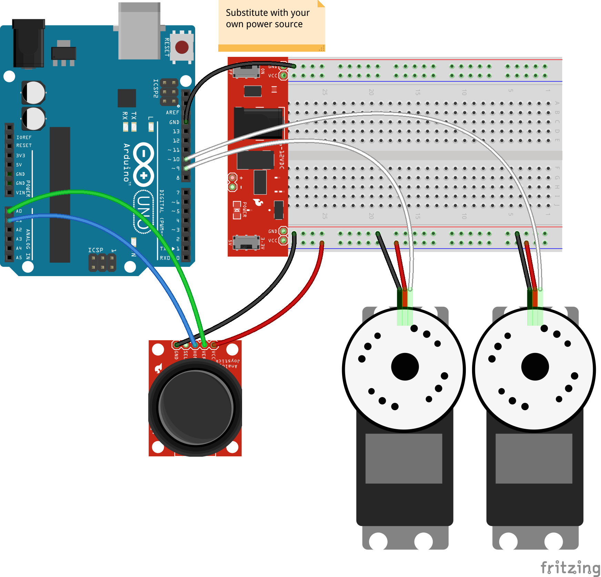

<!--remove-start-->

# Joystick - Pan + Tilt control

<!--remove-end-->


##### Breadboard for "Joystick - Pan + Tilt control"


<br>

Fritzing diagram: [docs/breadboard/joystick-pantilt.fzz](breadboard/joystick-pantilt.fzz)

&nbsp;


Run this example from the command line with:
```bash
node eg/joystick-pantilt.js
```


```javascript
var five = require("johnny-five");
var board = new five.Board();

board.on("ready", function() {
  var range = [0, 170];

  // Servo to control panning
  var pan = new five.Servo({
    pin: 9,
    range: range,
    center: true
  });

  // Servo to control tilt
  var tilt = new five.Servo({
    pin: 10,
    range: range,
    center: true
  });

  // Joystick to control pan/tilt
  // Read Analog 0, 1
  // Limit events to every 50ms
  var joystick = new five.Joystick({
    pins: ["A0", "A1"],
    freq: 100
  });


  joystick.on("change", function() {
    tilt.to(five.Fn.scale(this.y, -1, 1, 0, 170));
    pan.to(five.Fn.scale(this.x, -1, 1, 0, 170));
  });
});

```


&nbsp;

<!--remove-start-->

## License
Copyright (c) 2012-2014 Rick Waldron <waldron.rick@gmail.com>
Licensed under the MIT license.
Copyright (c) 2015-2020 The Johnny-Five Contributors
Licensed under the MIT license.

<!--remove-end-->
