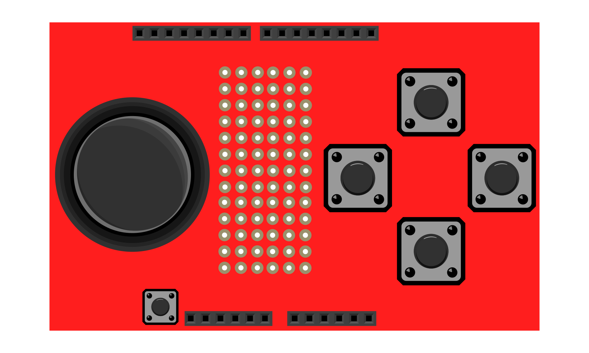

<!--remove-start-->

# Joystick - Sparkfun Shield

<!--remove-end-->


##### Joystick - Sparkfun Shield


Sparkfun Joystick Shield example.


<br>

&nbsp;


Run this example from the command line with:
```bash
node eg/joystick-shield.js
```


```javascript
var five = require("johnny-five");
var board = new five.Board();

board.on("ready", function() {
  var joystick = new five.Joystick({
    pins: ["A0", "A1"],
    invertY: true
  });

  joystick.on("change", function() {
    console.log("Joystick");
    console.log("  x : ", this.x);
    console.log("  y : ", this.y);
    console.log("--------------------------------------");
  });
});

```


&nbsp;

<!--remove-start-->

## License
Copyright (c) 2012-2014 Rick Waldron <waldron.rick@gmail.com>
Licensed under the MIT license.
Copyright (c) 2015-2020 The Johnny-Five Contributors
Licensed under the MIT license.

<!--remove-end-->
