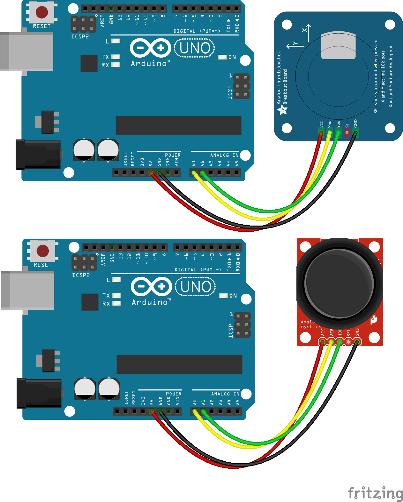

# Joystick

Run with:
```bash
node eg/joystick.js
```


```javascript
var five = require("johnny-five"),
    board, joystick;

board = new five.Board();

board.on("ready", function() {

  // Create a new `joystick` hardware instance.
  joystick = new five.Joystick({
    // Joystick pins are an array of pins
    // Pin orders:
    //   [ up, down, left, right ]
    //   [ ud, lr ]
    pins: [ "A0", "A1" ],
    freq: 500
  });

  // Inject the `joystick` hardware into
  // the Repl instance's context;
  // allows direct command line access
  board.repl.inject({
    joystick: joystick
  });

  // Joystick Event API

  joystick.on("axismove", function( err, timestamp ) {

    // Axis data is available on:
    // this.axis
    // {
    //   x: 0...1, ( 0 <-- L/R --> 1 )
    //   y: 0...1  ( 0 <-- D/U --> 1 )
    // }
    //
    // Center is ~0.5
    //
    // console.log( "input", this.axis );
    // console.log( "LR:", this.axis.x, this.normalized.x );
    // console.log( "UD:", this.axis.y, this.normalized.y );
    // console.log( "MAG:", this.magnitude );

    console.log( "LR:", this.fixed.x );
    console.log( "UD:", this.fixed.y );
    console.log( "MAG:", this.magnitude );

  });
});


// Schematic
// https://1965269182786388413-a-1802744773732722657-s-sites.googlegroups.com/site/parallaxinretailstores/home/2-axis-joystick/Joystick-6.png
// http://www.parallax.com/Portals/0/Downloads/docs/prod/sens/27800-Axis%20JoyStick_B%20Schematic.pdf

// Further Reading
// http://www.parallax.com/Portals/0/Downloads/docs/prod/sens/27800-2-AxisJoystick-v1.2.pdf

```

## Breadboard/Illustration


[docs/breadboard/joystick.fzz](breadboard/joystick.fzz)


## Devices


## Documentation

_(Nothing yet)_


## Contributing
All contributions must adhere to the [Idiomatic.js Style Guide](https://github.com/rwldrn/idiomatic.js),
by maintaining the existing coding style. Add unit tests for any new or changed functionality. Lint and test your code using [grunt](https://github.com/cowboy/grunt).

## Release History
_(Nothing yet)_

## License
Copyright (c) 2012 Rick Waldron <waldron.rick@gmail.com>
Licensed under the MIT license.
