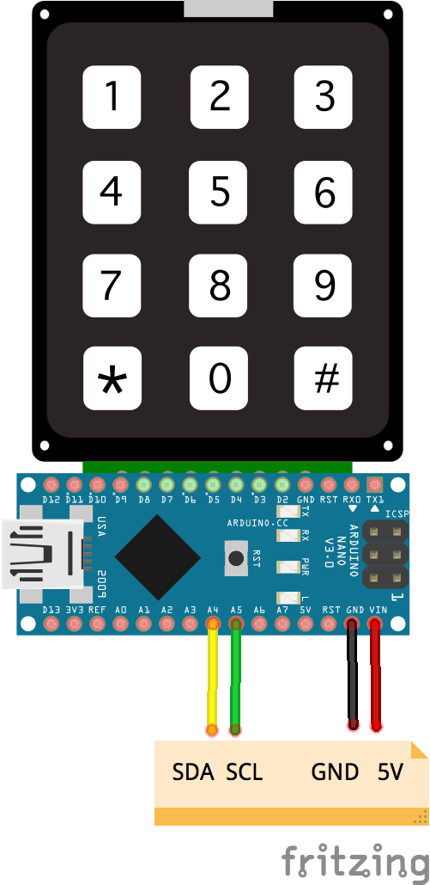
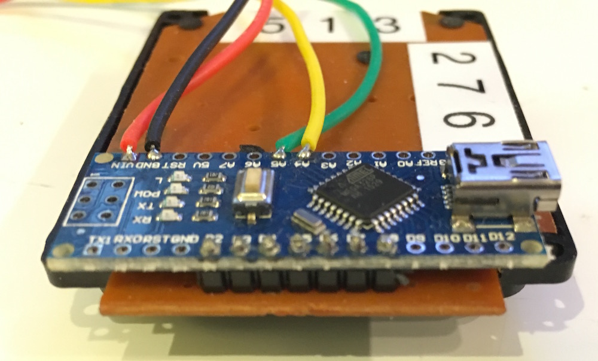
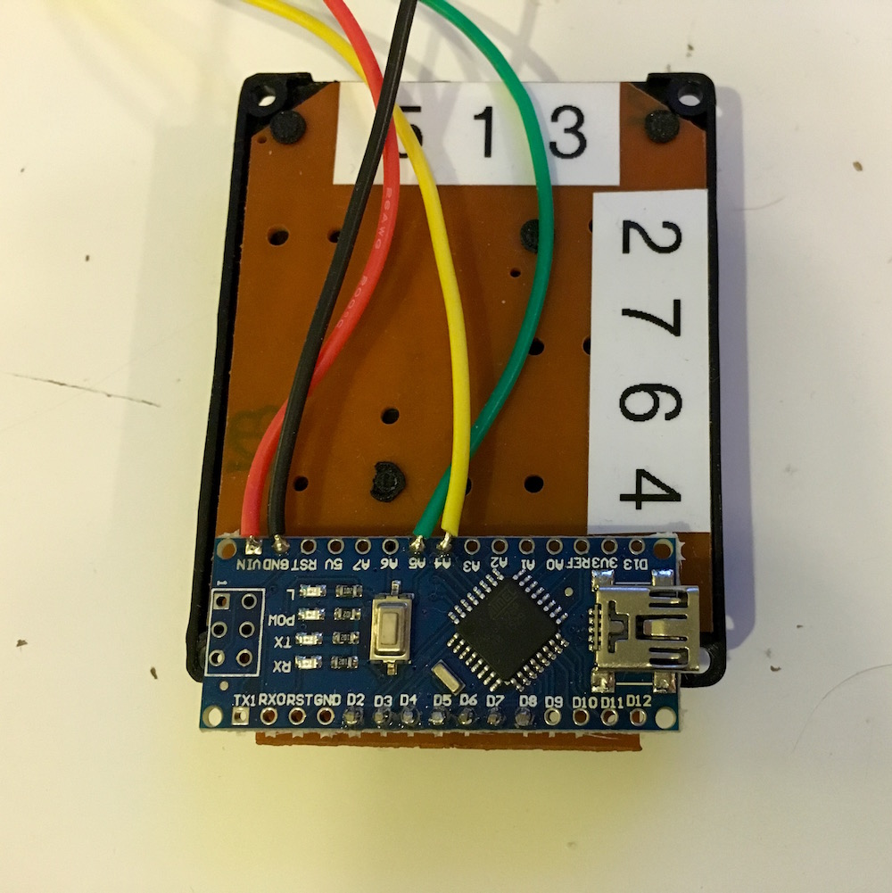

<!--remove-start-->

# Keypad - 3x4 I2C Nano Backpack

<!--remove-end-->


##### Breadboard for "Keypad - 3x4 I2C Nano Backpack"


<br>

Fritzing diagram: [docs/breadboard/keypad-3X4_I2C_NANO_BACKPACK.fzz](breadboard/keypad-3X4_I2C_NANO_BACKPACK.fzz)

&nbsp;


Run this example from the command line with:
```bash
node eg/keypad-3X4_I2C_NANO_BACKPACK.js
```


```javascript
var argv = require("minimist")(process.argv.slice(2), {
  default: {
    show: 1
  }
});
var five = require("johnny-five");
var board = new five.Board();

board.on("ready", function() {
  // 3X4_I2C_NANO_BACKPACK
  var keypad;

  if (argv.show === 1) {
    keypad = new five.Keypad({
      controller: "3X4_I2C_NANO_BACKPACK"
    });
  }

  if (argv.show === 2) {
    keypad = new five.Keypad({
      controller: "3X4_I2C_NANO_BACKPACK",
      keys: [
        ["!", "@", "#"],
        ["$", "%", "^"],
        ["&", "-", "+"],
        ["_", "=", ":"]
      ]
    });
  }

  if (argv.show === 3) {
    keypad = new five.Keypad({
      controller: "3X4_I2C_NANO_BACKPACK",
      keys: ["!", "@", "#", "$", "%", "^", "&", "-", "+", "_", "=", ":"]
    });
  }

  ["change", "press", "hold", "release"].forEach(function(eventType) {
    keypad.on(eventType, function(event) {
      console.log("Event: %s, Target: %s", eventType, event.which);
    });
  });
});

```


## Illustrations / Photos


### Nano soldering assembly 1


  

### Nano soldering assembly 2


  


## Learn More

- [I2C Backback Firmware](https://github.com/rwaldron/johnny-five/blob/master/firmwares/keypad_3x4_i2c_nano_backpack.ino)

&nbsp;

<!--remove-start-->

## License
Copyright (c) 2012-2014 Rick Waldron <waldron.rick@gmail.com>
Licensed under the MIT license.
Copyright (c) 2015-2020 The Johnny-Five Contributors
Licensed under the MIT license.

<!--remove-end-->
