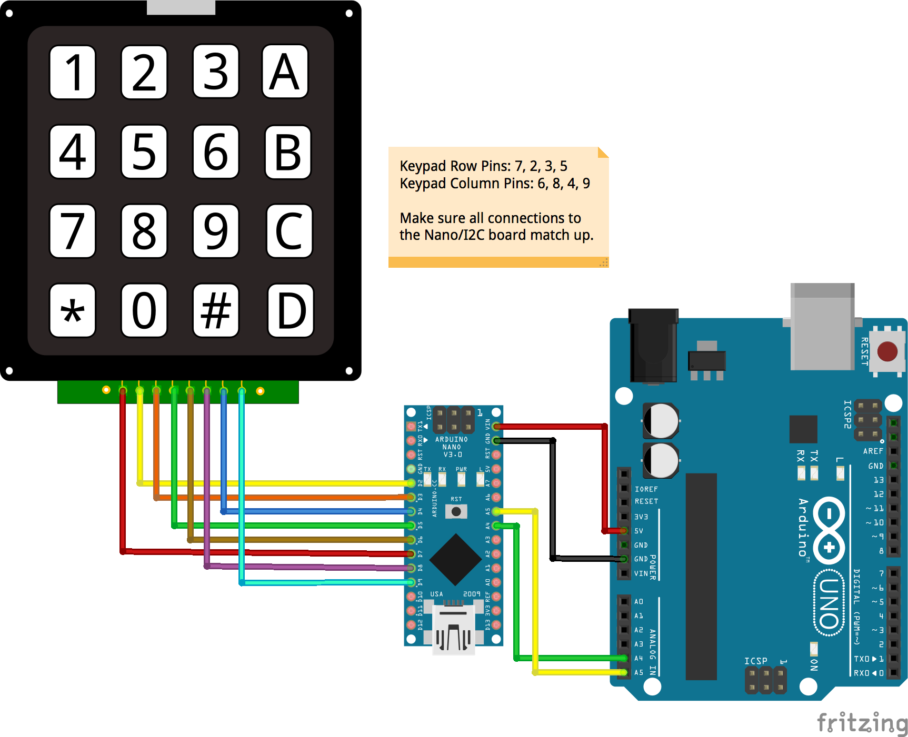

<!--remove-start-->

# Keypad - 4x4 I2C Nano Backpack

<!--remove-end-->


##### Breadboard for "Keypad - 4x4 I2C Nano Backpack"


<br>

Fritzing diagram: [docs/breadboard/keypad-4X4_I2C_NANO_BACKPACK.fzz](breadboard/keypad-4X4_I2C_NANO_BACKPACK.fzz)

&nbsp;


Run this example from the command line with:
```bash
node eg/keypad-4X4_I2C_NANO_BACKPACK.js
```


```javascript
var five = require("johnny-five");
var board = new five.Board();

board.on("ready", function() {
  
  // 4X4_I2C_NANO_BACKPACK Example
  var keypad = new five.Keypad({
    controller: "4X4_I2C_NANO_BACKPACK",
    /**
     * 
     * Default keys are set as:
     * [1, 2, 3, 'A', 4, 5, 6, 'B', 7, 8, 9, 'C', "*", 0, "#", 'D']
     * However, the Array can also be multi-dimensional and have a different
     * set of characters than the default.
     * 
     */
    keys: [
      ["!", "@", "#", "?"],
      ["$", "%", "^", "≠"],
      ["&", "-", "+", ";"],
      ["_", "=", ":", "¢"]
    ]
  });

  ["change", "press", "hold", "release"].forEach(function(eventType) {
    keypad.on(eventType, function(event) {
      console.log("Event: %s, Target: %s", eventType, event.which);
    });
  });
});

```


## Learn More

- [I2C Backback Firmware](https://github.com/rwaldron/johnny-five/blob/master/firmwares/keypad_4x4_i2c_nano_backpack.ino)

&nbsp;

<!--remove-start-->

## License
Copyright (c) 2012-2014 Rick Waldron <waldron.rick@gmail.com>
Licensed under the MIT license.
Copyright (c) 2015-2020 The Johnny-Five Contributors
Licensed under the MIT license.

<!--remove-end-->
