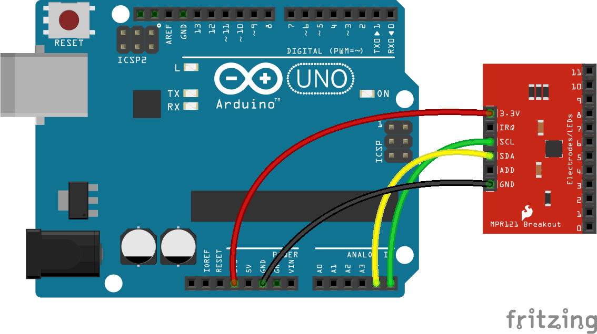

<!--remove-start-->

# Touchpad - MPR121

<!--remove-end-->


##### Breadboard for "Touchpad - MPR121"


<br>

Fritzing diagram: [docs/breadboard/keypad-MPR121.fzz](breadboard/keypad-MPR121.fzz)

&nbsp;


Run this example from the command line with:
```bash
node eg/keypad-MPR121.js
```


```javascript
var five = require("johnny-five");
var board = new five.Board();

board.on("ready", function() {
  var touchpad = new five.Touchpad({
    controller: "MPR121"
  });

  ["change", "press", "hold", "release"].forEach(function(eventType) {
    touchpad.on(eventType, function(event) {
      console.log("Event: %s, Target: %s", eventType, event.which);
    });
  });
});

```


&nbsp;

<!--remove-start-->

## License
Copyright (c) 2012-2014 Rick Waldron <waldron.rick@gmail.com>
Licensed under the MIT license.
Copyright (c) 2015-2020 The Johnny-Five Contributors
Licensed under the MIT license.

<!--remove-end-->
