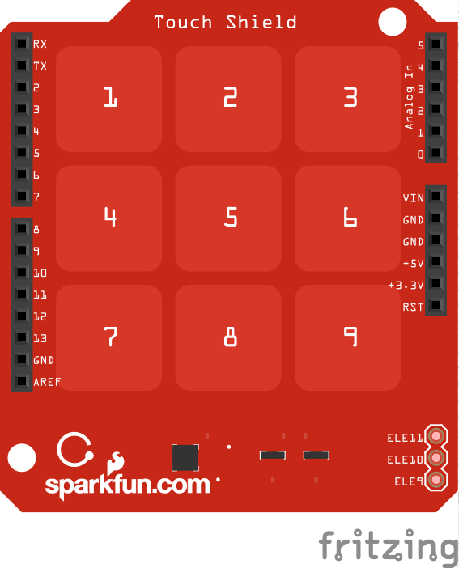

<!--remove-start-->

# Keypad - MPR121QR2

<!--remove-end-->


##### Breadboard for "Keypad - MPR121QR2"


<br>

Fritzing diagram: [docs/breadboard/keypad-MPR121QR2.fzz](breadboard/keypad-MPR121QR2.fzz)

&nbsp;


Run with:
```bash
node eg/keypad-MPR121QR2.js
```


```javascript
var exec = require("child_process").exec;
var argv = require("minimist")(process.argv.slice(2), { default: { show: 1 } });
var five = require("johnny-five");
var board = new five.Board();

board.on("ready", function() {
  // MPR121QR2 3x3 Capacitive Touch Shield
  var keypad;

  if (argv.show === 1) {
    keypad = new five.Keypad({
      controller: "MPR121QR2"
    });
  }

  if (argv.show === 2) {
    keypad = new five.Keypad({
      controller: "MPR121QR2",
      keys: [
        ["!", "@", "#"],
        ["$", "%", "^"],
        ["&", "-", "+"],
      ]
    });
  }

  if (argv.show === 3) {
    keypad = new five.Keypad({
      controller: "MPR121QR2",
      keys: ["!", "@", "#", "$", "%", "^", "&", "-", "+"]
    });
  }

  ["change", "press", "hold", "release"].forEach(function(eventType) {
    keypad.on(eventType, function(data) {
      console.log("Event: %s, Target: %s", eventType, data.which);
    });
  });
});

```


&nbsp;

<!--remove-start-->

## License
Copyright (c) 2012, 2013, 2014 Rick Waldron <waldron.rick@gmail.com>
Licensed under the MIT license.
Copyright (c) 2014, 2015 The Johnny-Five Contributors
Licensed under the MIT license.

<!--remove-end-->
