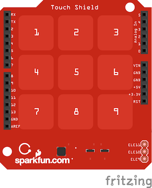

<!--remove-start-->

# Touchpad - MPR121QR2_SHIELD

<!--remove-end-->


##### Breadboard for "Touchpad - MPR121QR2_SHIELD"


<br>

Fritzing diagram: [docs/breadboard/keypad-MPR121QR2_SHIELD.fzz](breadboard/keypad-MPR121QR2_SHIELD.fzz)

&nbsp;


Run this example from the command line with:
```bash
node eg/keypad-MPR121QR2_SHIELD.js
```


```javascript
var argv = require("minimist")(process.argv.slice(2), {
  default: {
    show: 1
  }
});
var five = require("johnny-five");
var board = new five.Board();

board.on("ready", function() {
  // MPR121QR2 3x3 Capacitive Touch Shield
  var touchpad;

  if (argv.show === 1) {
    touchpad = new five.Touchpad({
      controller: "MPR121QR2_SHIELD"
    });
  }

  if (argv.show === 2) {
    touchpad = new five.Touchpad({
      controller: "MPR121QR2_SHIELD",
      keys: [
        ["!", "@", "#"],
        ["$", "%", "^"],
        ["&", "-", "+"],
      ]
    });
  }

  if (argv.show === 3) {
    touchpad = new five.Touchpad({
      controller: "MPR121QR2_SHIELD",
      keys: ["!", "@", "#", "$", "%", "^", "&", "-", "+"]
    });
  }

  ["change", "press", "hold", "release"].forEach(function(eventType) {
    touchpad.on(eventType, function(event) {
      console.log("Event: %s, Target: %s", eventType, event.which);
    });
  });
});

```


&nbsp;

<!--remove-start-->

## License
Copyright (c) 2012-2014 Rick Waldron <waldron.rick@gmail.com>
Licensed under the MIT license.
Copyright (c) 2015-2020 The Johnny-Five Contributors
Licensed under the MIT license.

<!--remove-end-->
