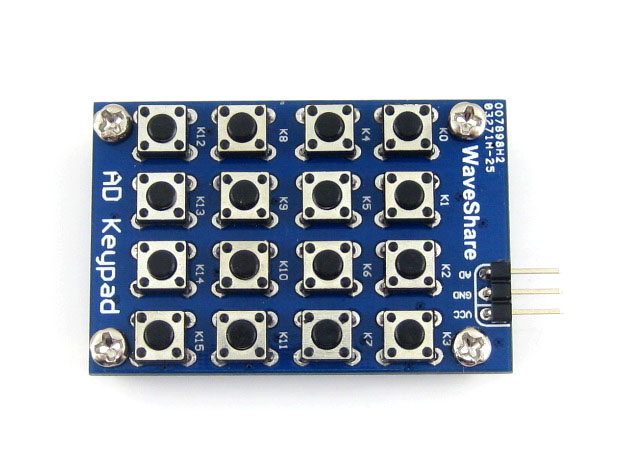

<!--remove-start-->

# Keypad - Waveshare AD

<!--remove-end-->


##### Breadboard for "Keypad - Waveshare AD"


<br>

&nbsp;


Run this example from the command line with:
```bash
node eg/keypad-analog-ad.js
```


```javascript
var argv = require("minimist")(process.argv.slice(2), {
  default: {
    show: 1
  }
});
var five = require("johnny-five");
var board = new five.Board();

board.on("ready", function() {
  // WaveShare AD Keypad
  var keypad;

  if (argv.show === 1) {
    keypad = new five.Keypad({
      pin: "A0",
      length: 16
    });
  }

  if (argv.show === 2) {
    keypad = new five.Keypad({
      pin: "A0",
      keys: [
        ["1", "!", "@", "#"],
        ["2", "$", "%", "^"],
        ["3", "&", "-", "+"],
        ["4", "<", ">", "?"],
      ]
    });
  }

  if (argv.show === 3) {
    keypad = new five.Keypad({
      pin: "A0",
      keys: ["1", "!", "@", "#", "2", "$", "%", "^", "3", "&", "-", "+", "4", "<", ">", "?"]
    });
  }

  ["change", "press", "hold", "release"].forEach(function(eventType) {
    keypad.on(eventType, function(event) {
      console.log("Event: %s, Target: %s", eventType, event.which);
    });
  });
});

```


&nbsp;

<!--remove-start-->

## License
Copyright (c) 2012-2014 Rick Waldron <waldron.rick@gmail.com>
Licensed under the MIT license.
Copyright (c) 2015-2020 The Johnny-Five Contributors
Licensed under the MIT license.

<!--remove-end-->
