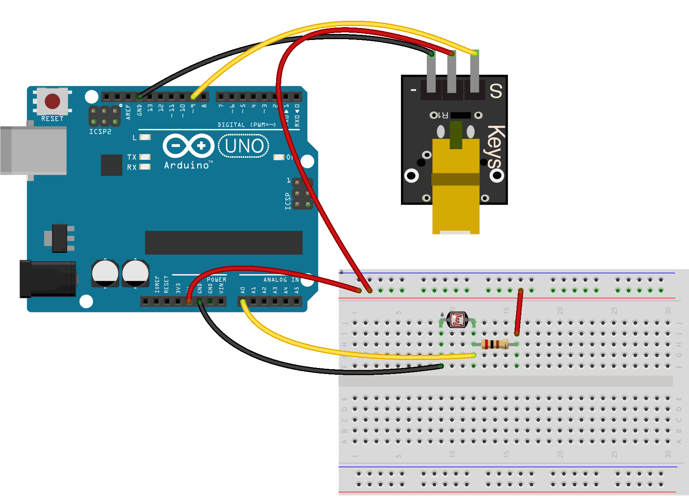

<!--remove-start-->

# Laser Trip Wire

<!--remove-end-->


##### Breadboard for "Laser Trip Wire"


<br>

&nbsp;


Run this example from the command line with:
```bash
node eg/laser-trip-wire.js
```


```javascript
var five = require("johnny-five");
var board = new five.Board();

board.on("ready", function() {
  var laser = new five.Led(9);
  var detection = new five.Sensor("A0");
  var isSecure = false;

  laser.on();

  detection.scale(0, 1).on("change", function() {
    var reading = !(this.value | 0);

    if (isSecure !== reading) {
      isSecure = reading;

      if (!isSecure) {
        console.log("Intruder");
      }
    }
  });
});

```


&nbsp;

<!--remove-start-->

## License
Copyright (c) 2012-2014 Rick Waldron <waldron.rick@gmail.com>
Licensed under the MIT license.
Copyright (c) 2015-2020 The Johnny-Five Contributors
Licensed under the MIT license.

<!--remove-end-->
