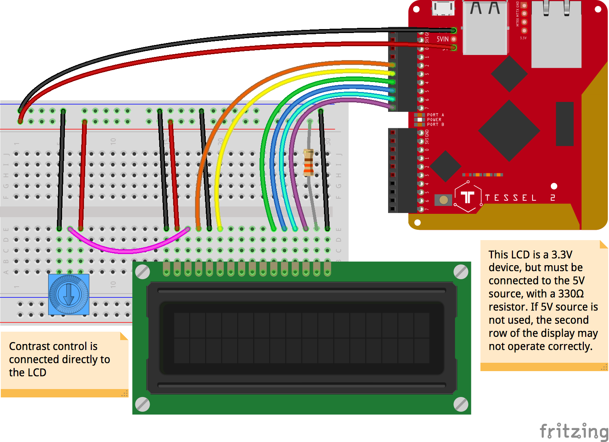

<!--remove-start-->

# LCD - Tessel 2 16x2

<!--remove-end-->


##### Breadboard for "LCD - Tessel 2 16x2"


<br>

Fritzing diagram: [docs/breadboard/lcd-16x2-tessel.fzz](breadboard/lcd-16x2-tessel.fzz)

&nbsp;


Run this example from the command line with:
```bash
node eg/lcd-16x2-tessel.js
```


```javascript
var five = require("johnny-five");
var Tessel = require("tessel-io");
var board = new five.Board({
  io: new Tessel()
});

board.on("ready", function() {
  var lcd = new five.LCD({
    // LCD pin:
    //      RS    EN    D4    D5    D6    D7
    pins: ["a2", "a3", "a4", "a5", "a6", "a7"],
  });

  lcd.cursor(0, 0).print("10".repeat(8));
  lcd.cursor(1, 0).print("01".repeat(8));
});

```


&nbsp;

<!--remove-start-->

## License
Copyright (c) 2012-2014 Rick Waldron <waldron.rick@gmail.com>
Licensed under the MIT license.
Copyright (c) 2015-2020 The Johnny-Five Contributors
Licensed under the MIT license.

<!--remove-end-->
