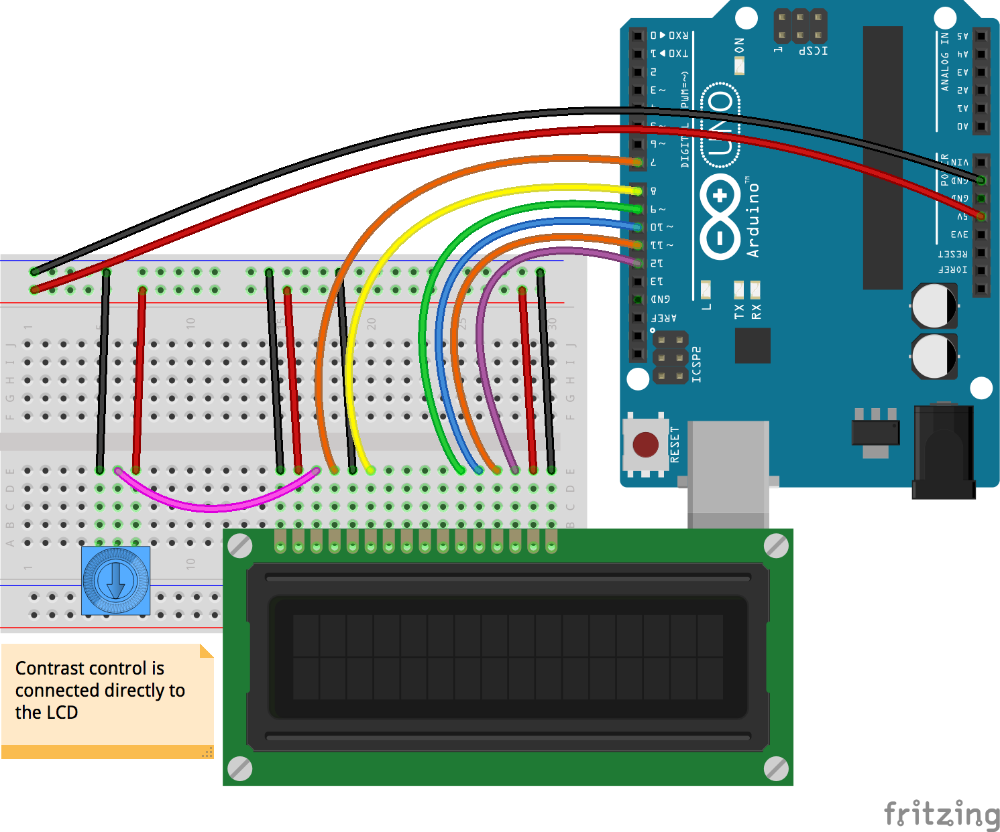

<!--remove-start-->

# LCD - Enumerate characters

<!--remove-end-->


##### Breadboard for "LCD - Enumerate characters"


<br>

Fritzing diagram: [docs/breadboard/lcd-enumeratechars.fzz](breadboard/lcd-enumeratechars.fzz)

&nbsp;


Run this example from the command line with:
```bash
node eg/lcd-enumeratechars.js
```


```javascript
var five = require("johnny-five");
var board = new five.Board();

board.on("ready", function() {

  var lcd = new five.LCD({
    // LCD pin name  RS  EN  DB4 DB5 DB6 DB7
    // Arduino pin # 7    8   9   10  11  12
    pins: [7, 8, 9, 10, 11, 12],
    rows: 4,
    cols: 20
  });

  var k = 0;
  var i = 0;
  var keys = Object.keys(five.LCD.Characters.DEFAULT);
  var length = keys.length;
  var eights = [];

  while (i < length) {
    eights.push(keys.slice(i, i + 8));
    i += 8;
  }

  console.log("Wait 5 seconds...");

  this.loop(2000, function() {
    var charset = eights[k],
      display = "";

    lcd.clear();

    if (k < eights.length) {

      charset.forEach(function(char, index) {
        lcd.useChar(char);
        display += ":" + char + ":";
      });

      lcd.clear().cursor(0, 0).print(display);

      k++;
    }
  });
});


```


## Additional Notes
- [16 x 2 LCD White on Blue](http://www.hacktronics.com/LCDs/16-x-2-LCD-White-on-Blue/flypage.tpl.html)
- [20 x 4 LCD White on Blue](http://www.hacktronics.com/LCDs/20-x-4-LCD-White-on-Blue/flypage.tpl.html)

&nbsp;

<!--remove-start-->

## License
Copyright (c) 2012-2014 Rick Waldron <waldron.rick@gmail.com>
Licensed under the MIT license.
Copyright (c) 2015-2020 The Johnny-Five Contributors
Licensed under the MIT license.

<!--remove-end-->
