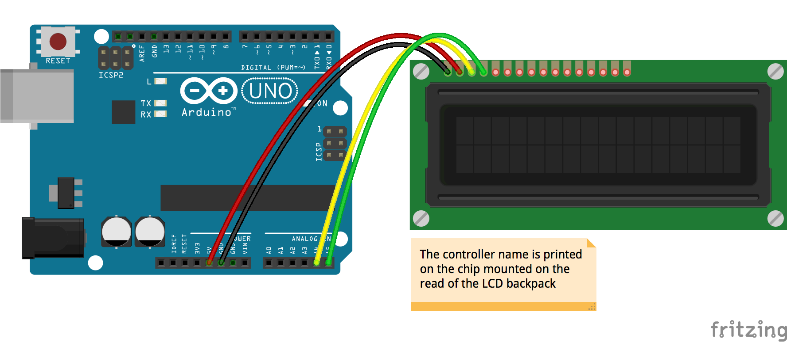

<!--remove-start-->

# LCD - I2C PCF8574

<!--remove-end-->


##### Breadboard for "LCD - I2C PCF8574"


<br>

&nbsp;


Run this example from the command line with:
```bash
node eg/lcd-i2c-PCF8574.js
```


```javascript
var five = require("johnny-five");
var board = new five.Board();

board.on("ready", function() {


  var random = Math.random().toString(36).replace(/[^a-z]+/g, "").substr(0, 4).toUpperCase();

  // Controller: PARALLEL (default)
  var p = new five.LCD({
    pins: [8, 9, 4, 5, 6, 7],
    backlight: 10,
  });

  p.useChar("heart");
  p.cursor(0, 0).print("hello :heart:");
  p.blink();
  p.cursor(1, 0).print("Blinking? ");
  p.cursor(0, 10).print(random);


  // Controller: JHD1313M1 (Grove)
  var j = new five.LCD({
    controller: "JHD1313M1"
  });

  j.useChar("heart");
  j.cursor(0, 0).print("hello :heart:");
  j.blink();
  j.cursor(1, 0).print("Blinking? ");
  j.cursor(0, 10).print(random);


  // Controller: PCF8574A (Generic I2C)
  // Locate the controller chip model number on the chip itself.
  var l = new five.LCD({
    controller: "PCF8574A"
  });

  l.useChar("heart");
  l.cursor(0, 0).print("hello :heart:");
  l.blink();
  l.cursor(1, 0).print("Blinking? ");
  l.cursor(0, 10).print(random);


  setTimeout(function() {
    process.exit(0);
  }, 3000);
});

```


&nbsp;

<!--remove-start-->

## License
Copyright (c) 2012-2014 Rick Waldron <waldron.rick@gmail.com>
Licensed under the MIT license.
Copyright (c) 2015-2020 The Johnny-Five Contributors
Licensed under the MIT license.

<!--remove-end-->
