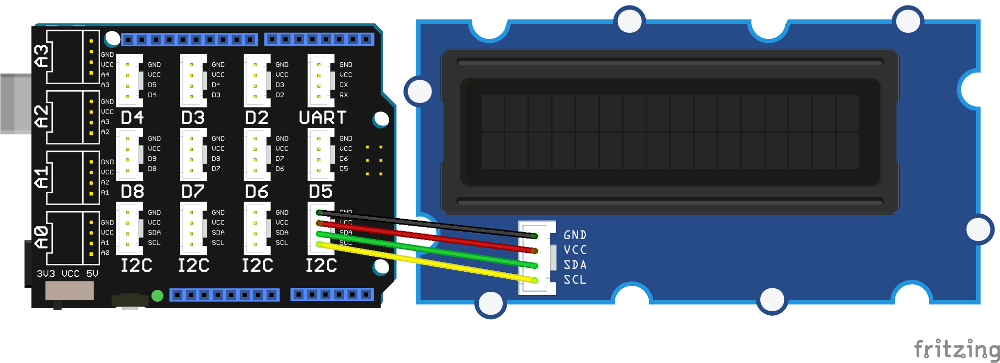

<!--remove-start-->

# LCD - I2C Runner

<!--remove-end-->


##### Breadboard for "LCD - I2C Runner"


<br>

&nbsp;


Run this example from the command line with:
```bash
node eg/lcd-i2c-runner.js
```


```javascript
var colors = require("../eg/color-list");
var five = require("../");
var board = new five.Board();

board.on("ready", function() {
  var clist = Object.keys(colors);
  var clength = clist.length;
  var lcd = new five.LCD({
    controller: "JHD1313M1"
  });

  var frame = 1;
  var frames = [":runninga:", ":runningb:"];
  var col = 0;
  var row = 0;

  // These calls will store the "runninga" and "runningb"
  // characters in the LCD's built-in memory. The LCD
  // allows up to 8 custom characters to be pre-loaded
  // into memory.
  //
  // http://johnny-five.io/api/lcd/#predefined-characters
  //
  lcd.useChar("runninga");
  lcd.useChar("runningb");

  this.loop(300, function() {
    lcd.clear().cursor(row, col).print(
      frames[frame ^= 1]
    );

    if (++col === lcd.cols) {
      col = 0;
      if (++row === lcd.rows) {
        row = 0;
      }
    }
  });


  this.loop(1000, function() {
    lcd.bgColor(clist[Math.floor(Math.random() * clength)]);
  });
});

```


&nbsp;

<!--remove-start-->

## License
Copyright (c) 2012-2014 Rick Waldron <waldron.rick@gmail.com>
Licensed under the MIT license.
Copyright (c) 2015-2020 The Johnny-Five Contributors
Licensed under the MIT license.

<!--remove-end-->
