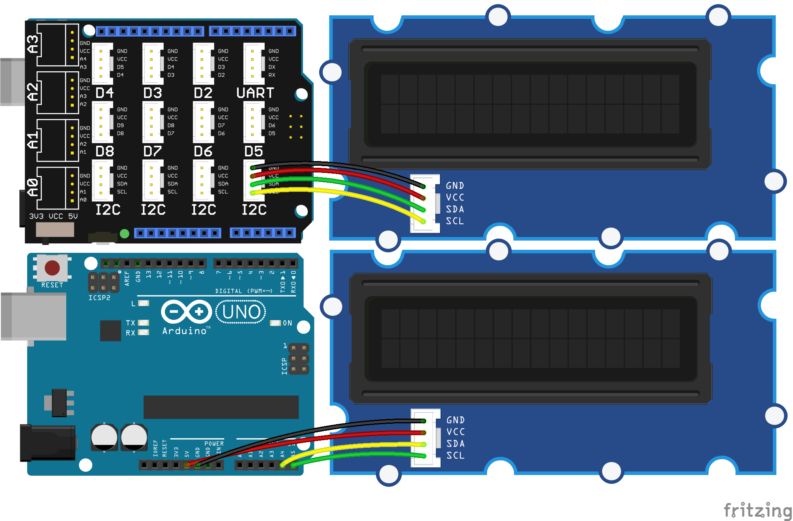

<!--remove-start-->

# Grove - RGB LCD Color Previewer

<!--remove-end-->


##### Using a Grove RGB LCD with and without the Grove Shield


<br>

Fritzing diagram: [docs/breadboard/lcd-JHD1313M1.fzz](breadboard/lcd-JHD1313M1.fzz)

&nbsp;


Run this example from the command line with:
```bash
node eg/lcd-rgb-bgcolor-previewer.js
```


```javascript
var five = require("../");
var board = new five.Board();
var colors = Object.keys(require("css-color-names"));

board.on("ready", () => {
  var lcd = new five.LCD({
    controller: "JHD1313M1"
  });

  lcd.bgColor("yellow");

  var interval = null;
  var index = 0;

  board.repl.inject({
    preview() {

      if (interval) {
        clearInterval(interval);
        index = 0;
      }

      interval = setInterval(() => {
        if (index === colors.length) {
          clearInterval(interval);
          return;
        }
        var color = colors[index++];
        lcd.bgColor(color).cursor(0, 0).clear().print(color);
      }, 1000);
    }
  });
});

```


&nbsp;

<!--remove-start-->

## License
Copyright (c) 2012-2014 Rick Waldron <waldron.rick@gmail.com>
Licensed under the MIT license.
Copyright (c) 2015-2020 The Johnny-Five Contributors
Licensed under the MIT license.

<!--remove-end-->
