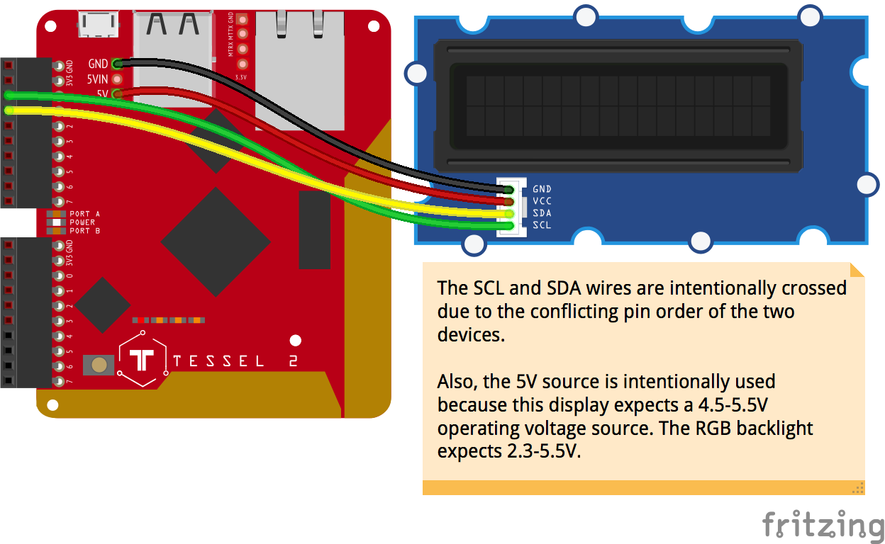

<!--remove-start-->

# Tessel 2 + Grove - RGB LCD Display

<!--remove-end-->


##### Breadboard for "Tessel 2 + Grove - RGB LCD Display"


<br>

Fritzing diagram: [docs/breadboard/lcd-rgb-tessel-grove-JHD1313M1.fzz](breadboard/lcd-rgb-tessel-grove-JHD1313M1.fzz)

&nbsp;


Run this example from the command line with:
```bash
node eg/lcd-rgb-tessel-grove-JHD1313M1.js
```


```javascript
var five = require("johnny-five");
var Tessel = require("tessel-io");
var board = new five.Board({
  io: new Tessel()
});

board.on("ready", function() {

  var lcd = new five.LCD({
    controller: "JHD1313M1"
  });

  lcd.bgColor("#ff0000");
  lcd.cursor(0, 0).print("Hello");
  lcd.cursor(1, 0).print("World!");
});

```


&nbsp;

<!--remove-start-->

## License
Copyright (c) 2012-2014 Rick Waldron <waldron.rick@gmail.com>
Licensed under the MIT license.
Copyright (c) 2015-2020 The Johnny-Five Contributors
Licensed under the MIT license.

<!--remove-end-->
