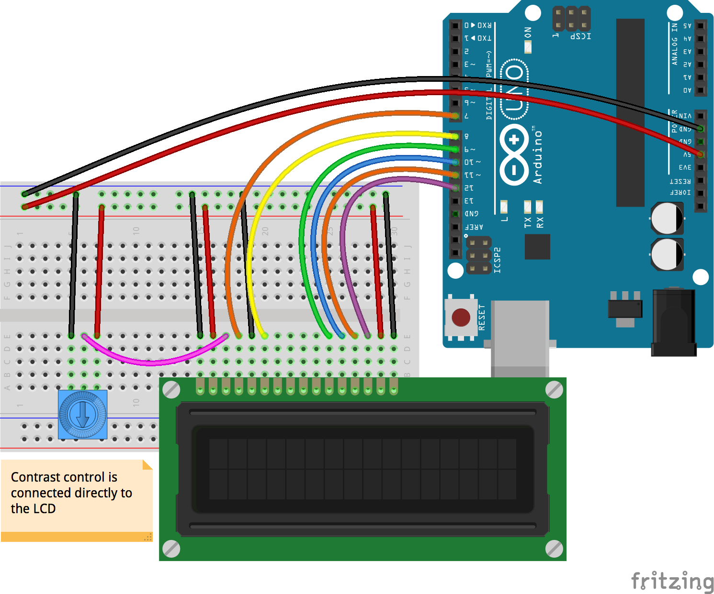

<!--remove-start-->

# LCD - Runner 16x2

<!--remove-end-->


##### Breadboard for "LCD - Runner 16x2"


<br>

Fritzing diagram: [docs/breadboard/lcd-runner.fzz](breadboard/lcd-runner.fzz)

&nbsp;


Run this example from the command line with:
```bash
node eg/lcd-runner.js
```


```javascript
var five = require("johnny-five");
var board = new five.Board();

board.on("ready", function() {

  var lcd = new five.LCD({
    // LCD pin name  RS  EN  DB4 DB5 DB6 DB7
    pins: [7, 8, 9, 10, 11, 12],
  });

  var frame = 1;
  var frames = [":runninga:", ":runningb:"];
  var row = 0;
  var col = 0;

  // These calls will store the "runninga" and "runningb"
  // characters in the LCD's built-in memory. The LCD
  // allows up to 8 custom characters to be pre-loaded
  // into memory.
  //
  // http://johnny-five.io/api/lcd/#predefined-characters
  //
  lcd.useChar("runninga");
  lcd.useChar("runningb");

  this.loop(300, function() {
    lcd.clear().cursor(row, col).print(
      frames[frame ^= 1]
    );

    if (++col === lcd.cols) {
      col = 0;
      if (++row === lcd.rows) {
        row = 0;
      }
    }
  });
});


// @device [16 x 2 LCD White on Blue](http://www.hacktronics.com/LCDs/16-x-2-LCD-White-on-Blue/flypage.tpl.html)
// @device [20 x 4 LCD White on Blue](http://www.hacktronics.com/LCDs/20-x-4-LCD-White-on-Blue/flypage.tpl.html)

```


&nbsp;

<!--remove-start-->

## License
Copyright (c) 2012-2014 Rick Waldron <waldron.rick@gmail.com>
Licensed under the MIT license.
Copyright (c) 2015-2020 The Johnny-Five Contributors
Licensed under the MIT license.

<!--remove-end-->
