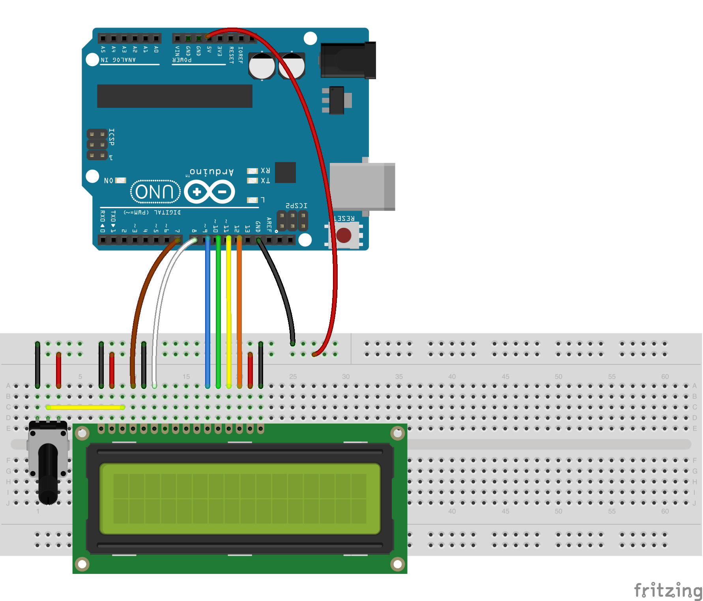

<!--remove-start-->

# LCD

<!--remove-end-->


##### Breadboard for "LCD"


<br>

Fritzing diagram: [docs/breadboard/lcd.fzz](breadboard/lcd.fzz)

&nbsp;


Run this example from the command line with:
```bash
node eg/lcd.js
```


```javascript
var five = require("johnny-five"),
  board, lcd;

board = new five.Board();

board.on("ready", function() {

  lcd = new five.LCD({
    // LCD pin name  RS  EN  DB4 DB5 DB6 DB7
    // Arduino pin # 7    8   9   10  11  12
    pins: [7, 8, 9, 10, 11, 12],
    backlight: 6,
    rows: 2,
    cols: 20


    // Options:
    // bitMode: 4 or 8, defaults to 4
    // lines: number of lines, defaults to 2
    // dots: matrix dimensions, defaults to "5x8"
  });

  // Tell the LCD you will use these characters:
  lcd.useChar("check");
  lcd.useChar("heart");
  lcd.useChar("duck");

  // Line 1: Hi rmurphey & hgstrp!
  lcd.clear().print("rmurphey, hgstrp");
  lcd.cursor(1, 0);

  // Line 2: I <3 johnny-five
  // lcd.print("I").write(7).print(" johnny-five");
  // can now be written as:
  lcd.print("I :heart: johnny-five");

  this.wait(3000, function() {
    lcd.clear().cursor(0, 0).print("I :check::heart: 2 :duck: :)");
  });

  this.repl.inject({
    lcd: lcd
  });
});


```


## Additional Notes
[16 x 2 LCD White on Blue](http://www.hacktronics.com/LCDs/16-x-2-LCD-White-on-Blue/flypage.tpl.html)
[20 x 4 LCD White on Blue](http://www.hacktronics.com/LCDs/20-x-4-LCD-White-on-Blue/flypage.tpl.html)

&nbsp;

<!--remove-start-->

## License
Copyright (c) 2012-2014 Rick Waldron <waldron.rick@gmail.com>
Licensed under the MIT license.
Copyright (c) 2015-2020 The Johnny-Five Contributors
Licensed under the MIT license.

<!--remove-end-->
