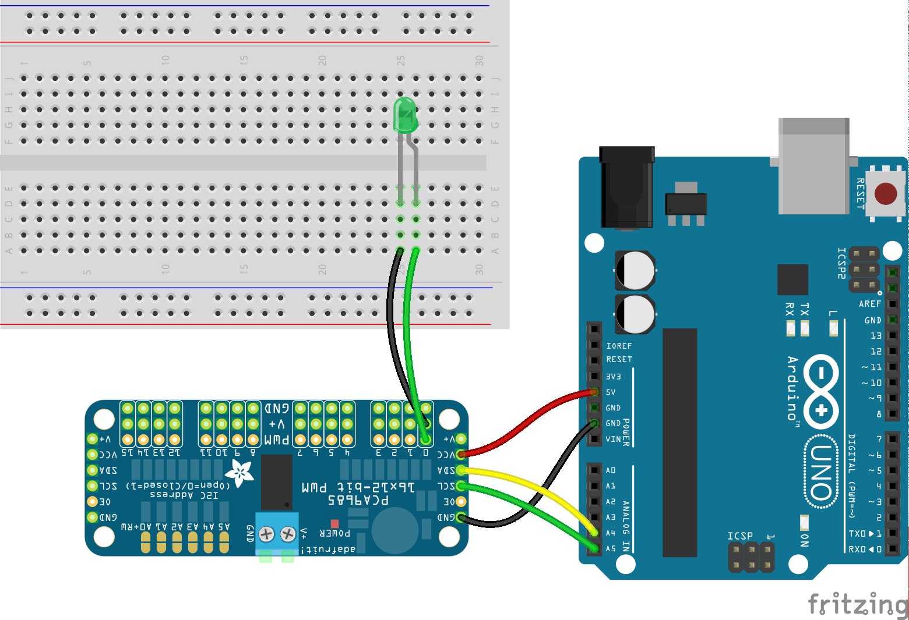

<!--remove-start-->

# LED - PCA9685

<!--remove-end-->


Basic LED example using PCA9685


##### Breadboard for "LED - PCA9685"


<br>

Fritzing diagram: [docs/breadboard/led-PCA9685.fzz](breadboard/led-PCA9685.fzz)

&nbsp;


Run this example from the command line with:
```bash
node eg/led-PCA9685.js
```


```javascript
const { Board, Led } = require("johnny-five");
const board = new Board();

board.on("ready", () => {
  const led = new Led({
    pin: process.argv[2] || 0,
    address: 0x40,
    controller: "PCA9685"
  });

  // address: The address of the shield.
  //    Defaults to 0x40
  // pin: The pin the LED is connected to
  //    Defaults to 0
  // controller: The type of controller being used.
  //   Defaults to "standard".

  // Add LED to REPL (optional)
  board.repl.inject({ led });

  led.pulse();
});

```


&nbsp;

<!--remove-start-->

## License
Copyright (c) 2012-2014 Rick Waldron <waldron.rick@gmail.com>
Licensed under the MIT license.
Copyright (c) 2015-2020 The Johnny-Five Contributors
Licensed under the MIT license.

<!--remove-end-->
