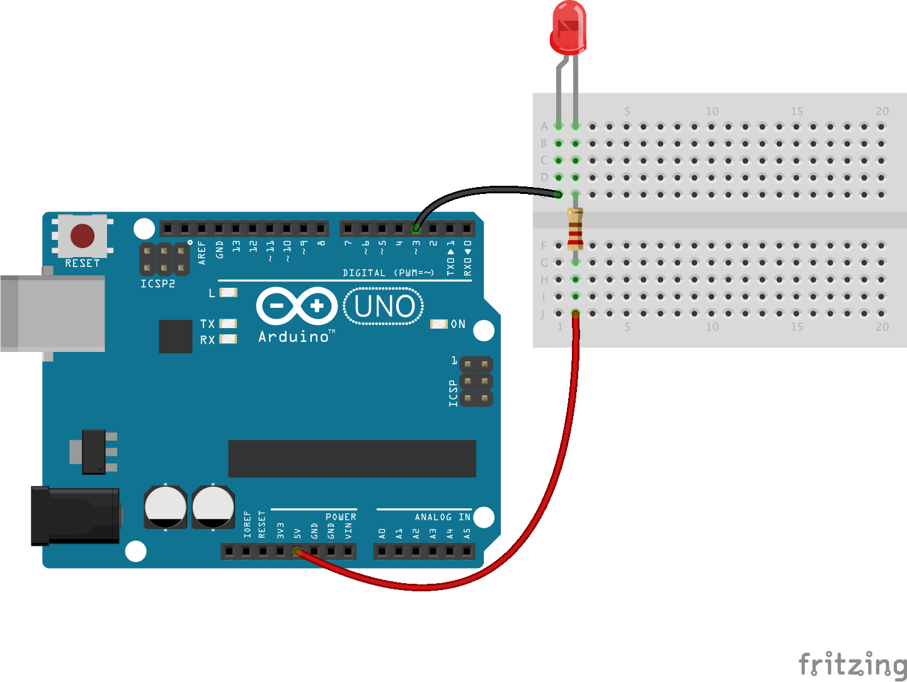

<!--remove-start-->
# LED (Common Anode)

Run with:
```bash
node eg/led-anode.js
```
<!--remove-end-->

```javascript
var five = require("johnny-five"),
  board = new five.Board();

board.on("ready", function() {
  var led = new five.Led({
    pin: 3,
    isAnode: true
  });

  led.blink();
});

```


## Breadboard/Illustration



[docs/breadboard/led-anode.fzz](breadboard/led-anode.fzz)


<!--remove-start-->
## License
Copyright (c) 2012, 2013, 2014 Rick Waldron <waldron.rick@gmail.com>
Licensed under the MIT license.
Copyright (c) 2014, 2015 The Johnny-Five Contributors
Licensed under the MIT license.
<!--remove-end-->
