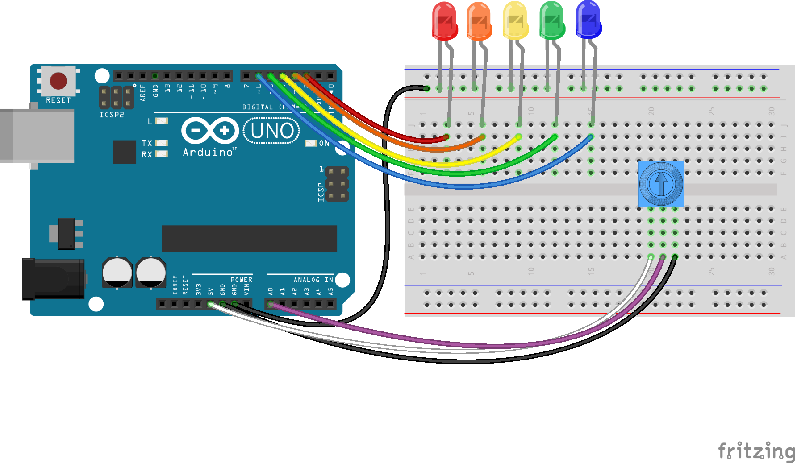

<!--remove-start-->

# LEDs - Controlling an array of LEDs

<!--remove-end-->


Demonstrates controlling multiple LEDs at once through the use of an LED array and an analog Potentiometer.


##### Breadboard for "LEDs - Controlling an array of LEDs"


<br>

Fritzing diagram: [docs/breadboard/led-array-controller.fzz](breadboard/led-array-controller.fzz)

&nbsp;


Run this example from the command line with:
```bash
node eg/led-array-controller.js
```


```javascript
const {Board, Leds, Sensor} = require("johnny-five");
const board = new Board();

board.on("ready", () => {
  const leds = new Leds([2, 3, 4, 5, 6]);
  const pot = new Sensor("A0");

  pot.on("change", () => {
    const lastIndex = Math.round(pot.scaleTo([-1, 4]));

    if (lastIndex === -1) {
      leds.off();
    } else {
      leds.each((led, index) => {
        if (index <= lastIndex) {
          led.on();
        } else {
          led.off();
        }
      });
    }
  });
});

```


&nbsp;

<!--remove-start-->

## License
Copyright (c) 2012-2014 Rick Waldron <waldron.rick@gmail.com>
Licensed under the MIT license.
Copyright (c) 2015-2020 The Johnny-Five Contributors
Licensed under the MIT license.

<!--remove-end-->
