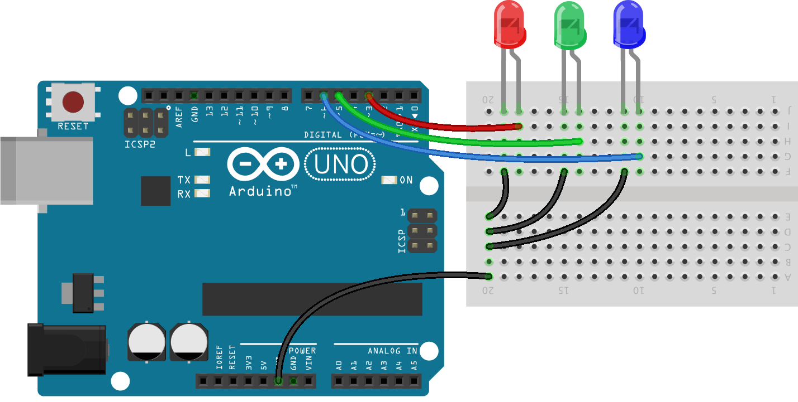

<!--remove-start-->

# LEDs - An array of LEDs

<!--remove-end-->


Demonstrates controlling multiple LEDs at once through the use of an LED array. Requires LEDs on pins that support PWM (usually denoted by ~).


##### Breadboard for "LEDs - An array of LEDs"


<br>

Fritzing diagram: [docs/breadboard/led-array.fzz](breadboard/led-array.fzz)

&nbsp;


Run this example from the command line with:
```bash
node eg/led-array.js
```


```javascript
const {Board, Leds} = require("johnny-five");
const board = new Board();

board.on("ready", () => {
  const leds = new Leds([3, 5, 6]);

  leds.pulse();
});

```


## Additional Notes
Control multiple LEDs at once by creating an LED collection (`Leds`).
All must be on PWM pins if you want to use methods such
as `pulse()` or `fade()`

&nbsp;

<!--remove-start-->

## License
Copyright (c) 2012-2014 Rick Waldron <waldron.rick@gmail.com>
Licensed under the MIT license.
Copyright (c) 2015-2020 The Johnny-Five Contributors
Licensed under the MIT license.

<!--remove-end-->
