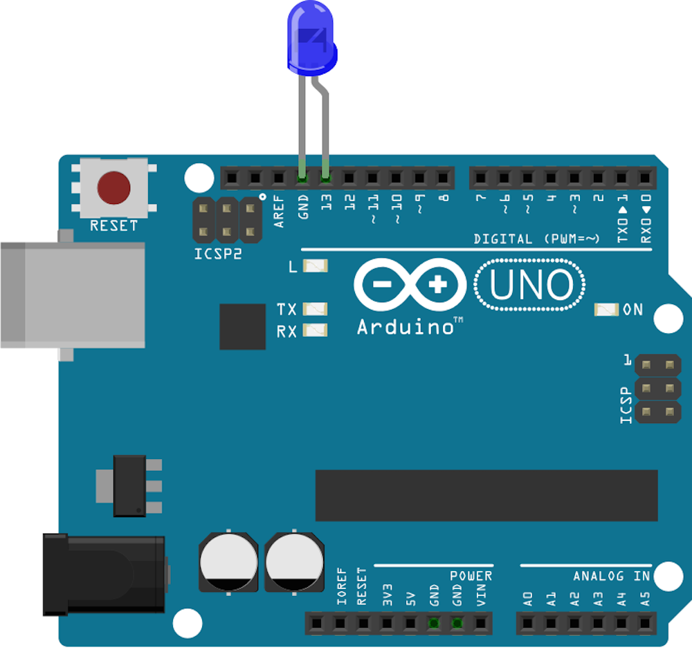

<!--remove-start-->
# LED - Blink

Run with:
```bash
node eg/led-blink.js
```
<!--remove-end-->

```javascript
var five = require("johnny-five");
var board = new five.Board();

board.on("ready", function() {

  // Create a standard `led` component instance
  var led = new five.Led(13);

  // "blink" the led in 500ms on-off phase periods
  led.blink(500);
});

```


## Breadboard/Illustration





<!--remove-start-->
## License
Copyright (c) 2012, 2013, 2014 Rick Waldron <waldron.rick@gmail.com>
Licensed under the MIT license.
Copyright (c) 2014, 2015 The Johnny-Five Contributors
Licensed under the MIT license.
<!--remove-end-->
