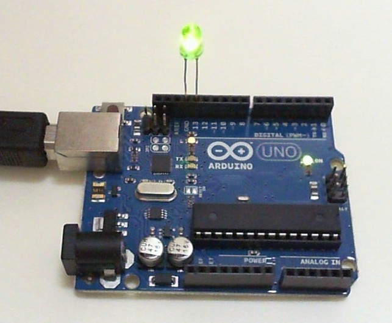
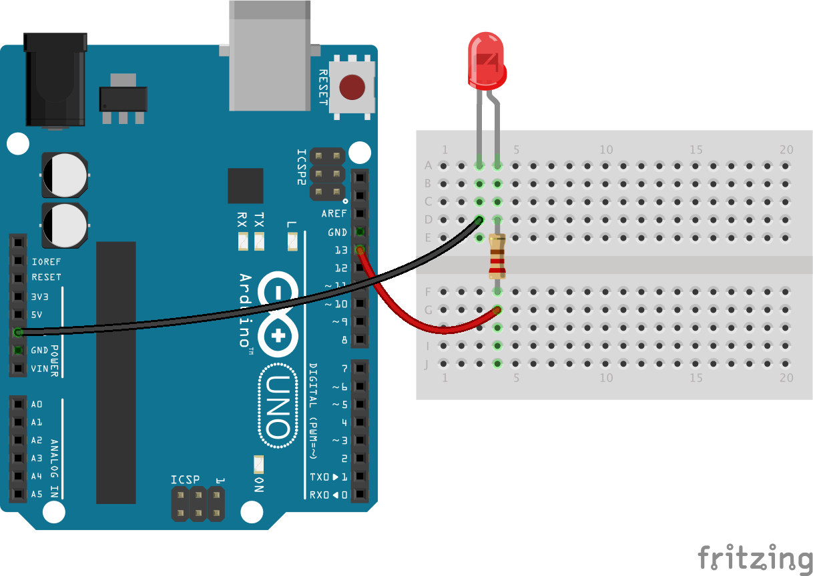

<!--remove-start-->

# LED - Blink

<!--remove-end-->


Basic LED blink example.


##### LED on pin 13 (Arduino UNO)


LED inserted directly into pin 13


<br>

Fritzing diagram: [docs/breadboard/led-13.fzz](breadboard/led-13.fzz)

&nbsp;


Run this example from the command line with:
```bash
node eg/led-blink.js
```


```javascript
const { Board, Led } = require("johnny-five");
const board = new Board();

board.on("ready", () => {
  const led = new Led(13);

  // "blink" the led in 500ms on-off phase periods
  led.blink(500);
});

```


## Illustrations / Photos


### LED on pin 13 (Arduino UNO)


LED inserted directly into pin 13


  

##### LED on pin 13 with breadboard and resistor (Arduino UNO)


LED on a breadboard and demonstrating use of a resistor


<br>

Fritzing diagram: [docs/breadboard/led-resistor.fzz](breadboard/led-resistor.fzz)

&nbsp;


&nbsp;

<!--remove-start-->

## License
Copyright (c) 2012-2014 Rick Waldron <waldron.rick@gmail.com>
Licensed under the MIT license.
Copyright (c) 2015-2020 The Johnny-Five Contributors
Licensed under the MIT license.

<!--remove-end-->
