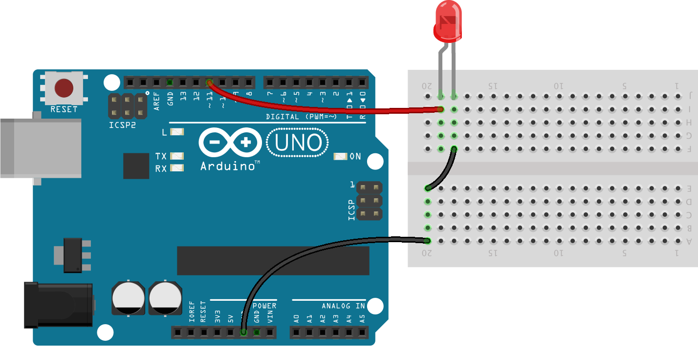

<!--remove-start-->
# LED - Demo Sequence

Run with:
```bash
node eg/led-demo-sequence.js
```
<!--remove-end-->

```javascript
var five = require("johnny-five");
var board = new five.Board();
var led;

// Demonstrates stringing some of the LED commands together
// through the use of a "demo sequence" array that is
// recursively called for each step.
//


// Do we want the sequence to loop?
var loop = true;

// Create a simple demo sequece that calls various
// five.Led methods with specified arguments and
// let it run for the given duration (defaults to 3 seconds).
var demoSequence = [{
  method: "pulse",
  args: [1000],
  duration: 5000
}, {
  method: "strobe",
  args: [500],
  duration: 3000
}, {
  method: "fadeIn",
  args: [
    2000,
    function() {
      console.log("fadeIn complete!");
    }
  ],
  duration: 2500
}, {
  method: "fadeOut",
  args: [
    5000,
    function() {
      console.log("fadeOut complete!");
    }
  ],
  duration: 5500
}, {
  method: "brightness",
  args: [10],
  duration: 3000
}, {
  method: "off"
}];


// Execute a method in the demo sequence
function execute(step) {

  // Grab everything we need for this step
  var method = demoSequence[step].method;
  var args = demoSequence[step].args;
  var duration = demoSequence[step].duration || 3000;

  // Just print out what we're executing
  console.log("led." + method + "(" + (args ? args.join() : "") + ")");

  // Make the actual call to the LED
  five.Led.prototype[method].apply(led, args);

  // Increment the step
  step++;

  // If we're at the end, start over (loop==true) or exit
  if (step === demoSequence.length) {
    if (loop) {
      step = 0;
    } else {
      // We're done!
      process.exit(0);
    }
  }

  // Recursively call the next step after specified duration
  board.wait(duration, function() {
    execute(step);
  });
}

board.on("ready", function() {
  // Defaults to pin 11 (must be PWM)
  led = new five.Led(process.argv[2] || 11);

  // Kick off the first step
  execute(0);
});

```


## Breadboard/Illustration



[(Fritzing diagram)](breadboard/led-demo-sequence.fzz)


<!--remove-start-->
## License
Copyright (c) 2012, 2013, 2014 Rick Waldron <waldron.rick@gmail.com>
Licensed under the MIT license.
Copyright (c) 2014, 2015 The Johnny-Five Contributors
Licensed under the MIT license.
<!--remove-end-->
