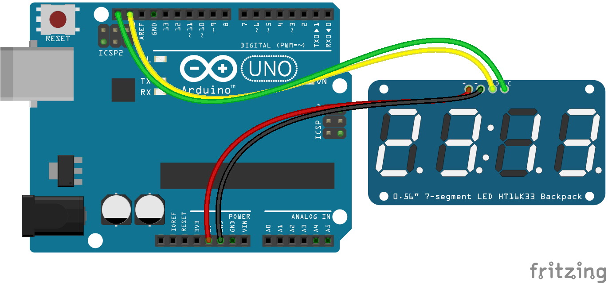

<!--remove-start-->

# LED - Digital Clock, HT16K33

<!--remove-end-->


##### Breadboard for "LED - Digital Clock, HT16K33"


<br>

Fritzing diagram: [docs/breadboard/led-digits-clock-HT16K33.fzz](breadboard/led-digits-clock-HT16K33.fzz)

&nbsp;


Run this example from the command line with:
```bash
node eg/led-digits-clock-HT16K33.js
```


```javascript
var moment = require("moment");
var five = require("johnny-five");
var board = new five.Board();

board.on("ready", function() {
  var digits = new five.Led.Digits({
    controller: "HT16K33",
  });
  var toggle = 0;

  setInterval(function() {
    // Toggle the colon part: on for a second, off for a second.
    digits.print(time(toggle ^= 1));
  }, 1000);
});

function time(showColon) {
  var display = "    " + moment().format(
    showColon ? "h:mm" : "h mm"
  );
  return display.slice(-5);
}

```


## Additional Notes
Learn More:
- [JavaScript: A Digital Clock with Johnny-Five](http://bocoup.com/weblog/javascript-arduino-digital-clock-johnny-five/)

&nbsp;

<!--remove-start-->

## License
Copyright (c) 2012, 2013, 2014 Rick Waldron <waldron.rick@gmail.com>
Licensed under the MIT license.
Copyright (c) 2018 The Johnny-Five Contributors
Licensed under the MIT license.

<!--remove-end-->
