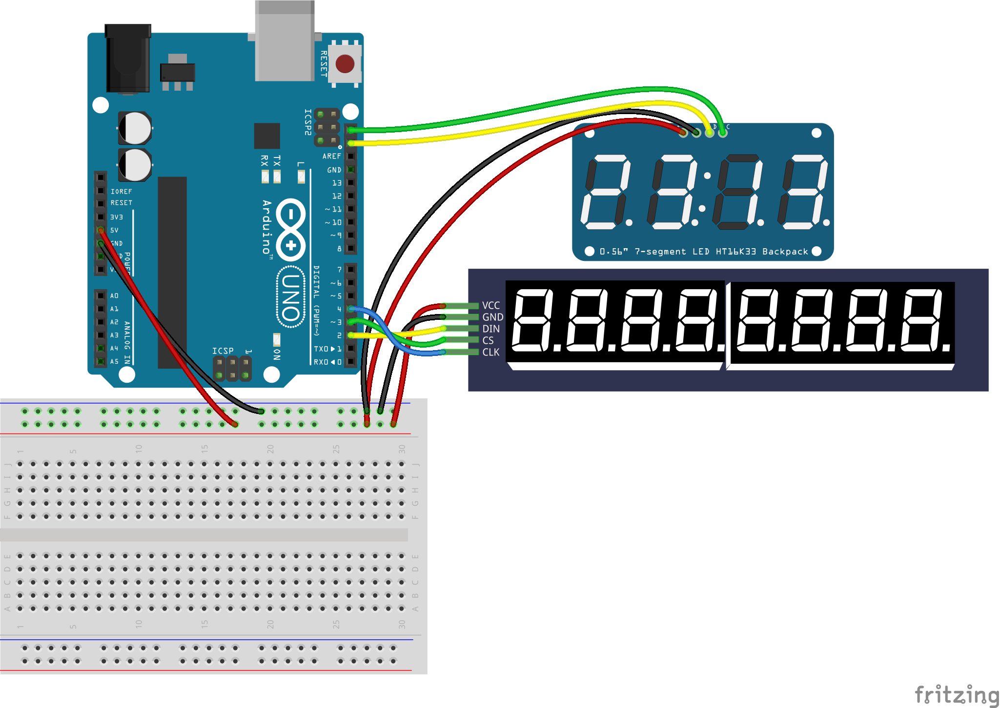

<!--remove-start-->

# LED - Digital Clock, Dual Displays

<!--remove-end-->


Demonstrates using dual 7 Segment displays.


##### Breadboard for "LED - Digital Clock, Dual Displays"


<br>

Fritzing diagram: [docs/breadboard/led-digits-clock-dual.fzz](breadboard/led-digits-clock-dual.fzz)

&nbsp;


Run this example from the command line with:
```bash
node eg/led-digits-clock-dual.js
```


```javascript
const moment = require("moment");
const { Board, Led } = require("johnny-five");

const board = new Board();

board.on("ready", () => {
  const hmm = new Led.Digits({
    controller: "HT16K33",
  });
  const seconds = new Led.Digits({
    pins: {
      data: 2,
      cs: 3,
      clock: 4,
    }
  });

  let minute = null;
  let toggle = 0;

  setInterval(() => {
    const now = moment();
    const min = now.minute();
    let form;

    if (minute !== min) {
      minute = min;
      form = (toggle ^= 1) ? "h:mm" : "hmm";
      hmm.print((" " + now.format(form)).slice(-5));
    }
    seconds.print("  " + now.format("ss.SSSS"));
  }, 200);
});

```


<iframe width="560" height="315" src="https://www.youtube.com/embed/iD8S--2aJEo" frameborder="0" allowfullscreen></iframe>


## Additional Notes
Learn More:
- [JavaScript: A Digital Clock with Johnny-Five](http://bocoup.com/weblog/javascript-arduino-digital-clock-johnny-five/)

&nbsp;

<!--remove-start-->

## License
Copyright (c) 2012-2014 Rick Waldron <waldron.rick@gmail.com>
Licensed under the MIT license.
Copyright (c) 2015-2020 The Johnny-Five Contributors
Licensed under the MIT license.

<!--remove-end-->
