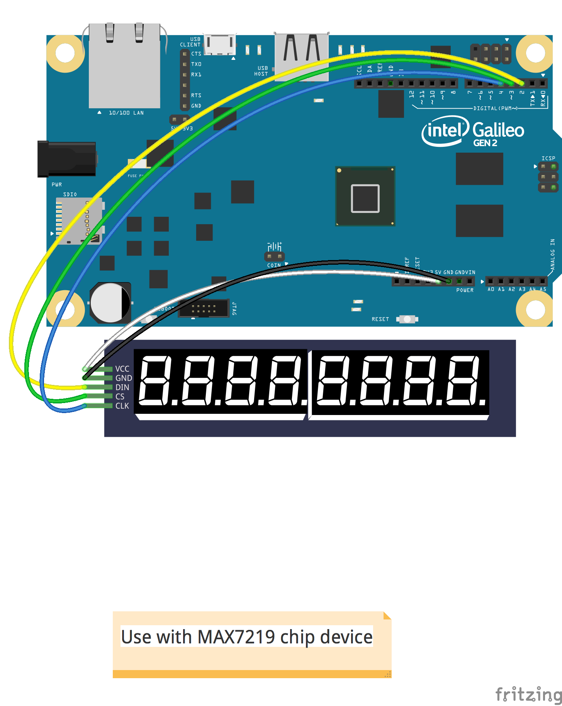

<!--remove-start-->

# LED - Digital Clock

<!--remove-end-->


Demonstrates using 7 Segment Digits and Intel Galileo Gen 2 to create a clock! This example can easily be ported to use any other supported platform.


##### Galileo Diagram


<br>

Fritzing diagram: [docs/breadboard/led-digits-clock-galileo.fzz](breadboard/led-digits-clock-galileo.fzz)

&nbsp;


Run this example from the command line with:
```bash
node eg/led-digits-clock-galileo.js
```


```javascript
const moment = require("moment");
const { Board, Led } = require("johnny-five");
const Galileo = require("galileo-io");

const board = new Board({
  io: new Galileo()
});

board.on("ready", () => {
  var digits = new Led.Digits({
    pins: {
      data: 2,
      cs: 3,
      clock: 4,
    }
  });

  setInterval(() => digits.print(time()), 1000);
});

function time() {
  /*
    The desired display looks something
    like these examples:

      02.25.54 P
      12.30.00 A

    moment doesn't have an option for
    a single letter meridiem (nor should it,
    that would be silly), so we need to
    manipulate the string a bit to so that
    it the string matches our desired display.
   */
  return moment().format("hh.mm.ssA")
    .replace(/([AP])M/, " $1");
}

```


## Illustrations / Photos


##### Arduino Diagram


<br>

Fritzing diagram: [docs/breadboard/led-digits-clock-arduino.fzz](breadboard/led-digits-clock-arduino.fzz)

&nbsp;


<iframe width="560" height="315" src="https://www.youtube.com/embed/4A3SlE6Unco" frameborder="0" allowfullscreen></iframe>


## Learn More

- [JavaScript: A Digital Clock with Johnny-Five](http://bocoup.com/weblog/javascript-arduino-digital-clock-johnny-five/)

&nbsp;

<!--remove-start-->

## License
Copyright (c) 2012-2014 Rick Waldron <waldron.rick@gmail.com>
Licensed under the MIT license.
Copyright (c) 2015-2020 The Johnny-Five Contributors
Licensed under the MIT license.

<!--remove-end-->
