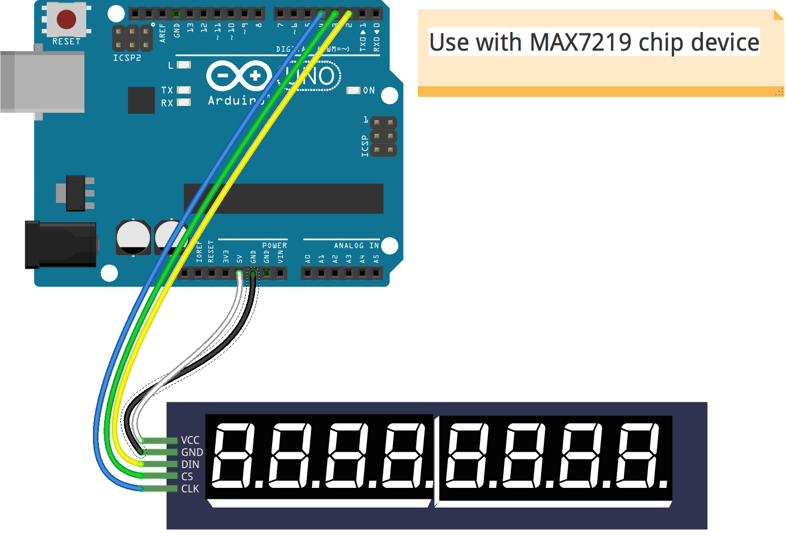

<!--remove-start-->
# LED - Digital Clock

Run with:
```bash
node eg/led-digits-clock.js
```
<!--remove-end-->

```javascript
var moment = require("moment");
var five = require("johnny-five");
var board = new five.Board();

board.on("ready", function() {
  var digits = new five.Led.Digits({
    pins: {
      data: 2,
      cs: 3,
      clock: 4,
    }
  });

  setInterval(function() {
    digits.print(time());
  }, 1000);
});

function time() {
  /*
    The desired display looks something
    like these examples:

      02.25.54 P
      12.30.00 A

    moment doesn't have an option for
    a single letter meridiem (nor should it,
    that would be silly), so we need to
    manipulate the string a bit to so that
    it the string matches our desired display.
   */
  return moment().format("hh.mm.ssA")
    .replace(/([AP])M/, " $1");
}


```


## Breadboard/Illustration


  
[(Fritzing diagram)](breadboard/led-digits-clock.fzz)


Learn More:

- [JavaScript: A Digital Clock with Johnny-Five](http://bocoup.com/weblog/javascript-arduino-digital-clock-johnny-five/)


<!--remove-start-->
## License
Copyright (c) 2012, 2013, 2014 Rick Waldron <waldron.rick@gmail.com>
Licensed under the MIT license.
Copyright (c) 2014, 2015 The Johnny-Five Contributors
Licensed under the MIT license.
<!--remove-end-->
