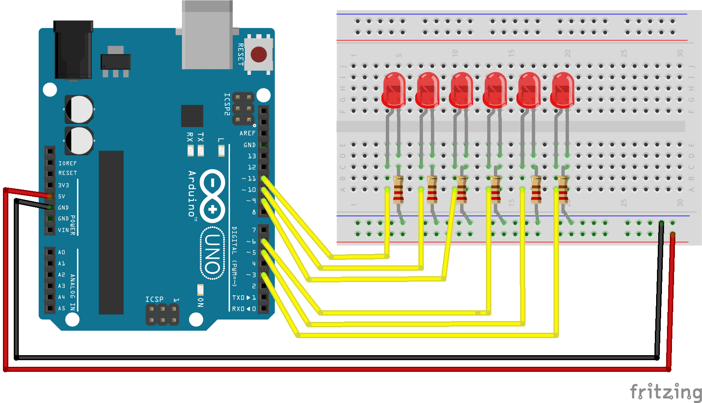

<!--remove-start-->

# LED - Fade callback

<!--remove-end-->


Demonstrates use of callbacks to fade out a series of LEDs one after the other. Requires LEDs on pins that support PWM (usually denoted by ~).


##### Breadboard for "LED - Fade callback"


<br>

Fritzing diagram: [docs/breadboard/led-fade-callback.fzz](breadboard/led-fade-callback.fzz)

&nbsp;


Run this example from the command line with:
```bash
node eg/led-fade-callback.js
```


```javascript
const {Board, Leds} = require("johnny-five");
const board = new Board();

board.on("ready", () => {
  // Set up the following PWM pins as LEDs.
  // Fade an LED out, and the complete callback will start
  // fading the next LED in sequence out, and so on.
  // If randomFade is true, then fading will happen in random
  // order instead of sequentially.
  const leds = new Leds([11, 10, 9, 6, 5, 3]);
  const timing = 250;
  const randomFade = true;
  const ledCount = leds.length;
  let fadeIndex = 0;

  function fadeNext() {
    let candidateIndex = fadeIndex;
    leds[fadeIndex].fadeIn(timing);

    // Determine the next LED to fade
    if (randomFade) {
      while (candidateIndex === fadeIndex) {
        candidateIndex = Math.round(Math.random() * (ledCount - 1));
      }
    } else {
      candidateIndex = (fadeIndex < ledCount - 1) ? fadeIndex + 1 : 0;
    }
    fadeIndex = candidateIndex;

    leds[fadeIndex].fadeOut(timing, fadeNext);
  }

  leds.on();
  leds[fadeIndex].fadeOut(timing, fadeNext);
});

```


&nbsp;

<!--remove-start-->

## License
Copyright (c) 2012-2014 Rick Waldron <waldron.rick@gmail.com>
Licensed under the MIT license.
Copyright (c) 2015-2020 The Johnny-Five Contributors
Licensed under the MIT license.

<!--remove-end-->
