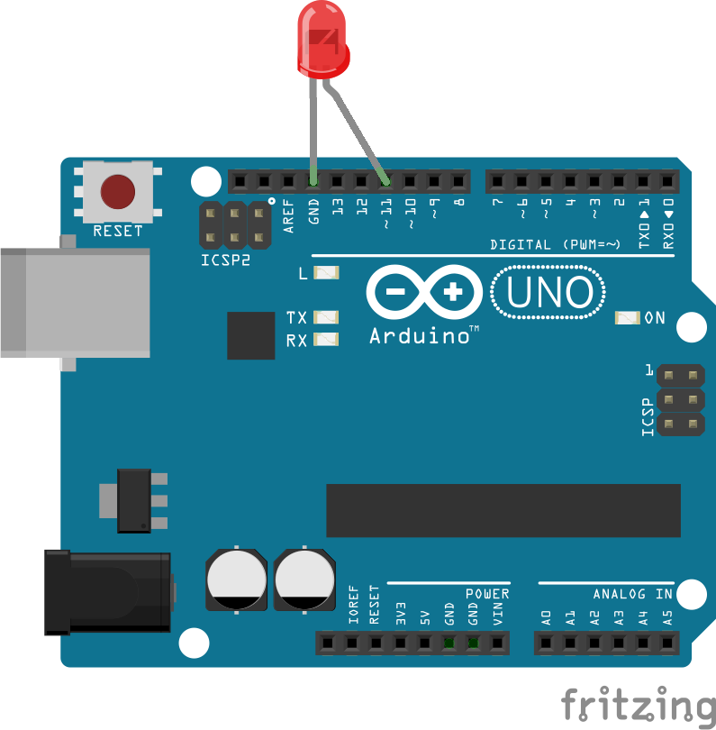

<!--remove-start-->

# LED - Fade

<!--remove-end-->


LED fade example that fades in an led, waits 5 seconds, and then fades it out. Requires LED on pin that supports PWM (usually denoted by ~).


##### LED on pin 11 (Arduino UNO)


LED inserted directly into pin 11.


<br>

Fritzing diagram: [docs/breadboard/led-11-pwm.fzz](breadboard/led-11-pwm.fzz)

&nbsp;


Run this example from the command line with:
```bash
node eg/led-fade.js
```


```javascript
const { Board, Led } = require("johnny-five");
const board = new Board();

board.on("ready", () => {
  const led = new Led(11);

  led.fadeIn();

  // Toggle the led after 5 seconds (shown in ms)
  board.wait(5000, () => {
    led.fadeOut();
  });
});

```


&nbsp;

<!--remove-start-->

## License
Copyright (c) 2012-2014 Rick Waldron <waldron.rick@gmail.com>
Licensed under the MIT license.
Copyright (c) 2015-2020 The Johnny-Five Contributors
Licensed under the MIT license.

<!--remove-end-->
