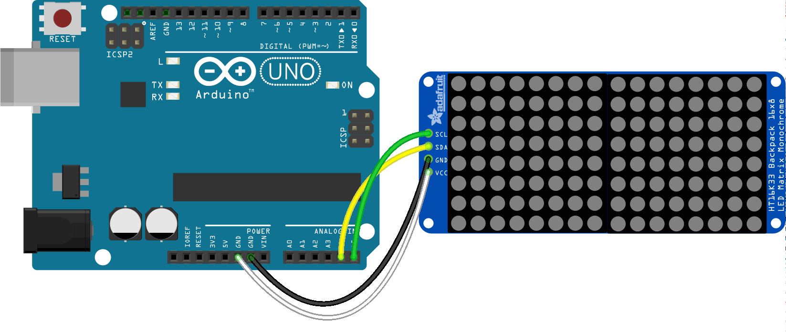

<!--remove-start-->

# LED - Matrix HT16K33 16x8

<!--remove-end-->


##### Breadboard for "LED - Matrix HT16K33 16x8"


<br>

Fritzing diagram: [docs/breadboard/led-matrix-HT16K33-16x8.fzz](breadboard/led-matrix-HT16K33-16x8.fzz)

&nbsp;


Run this example from the command line with:
```bash
node eg/led-matrix-HT16K33-16x8.js
```


```javascript
var five = require("johnny-five");
var board = new five.Board();

board.on("ready", function() {

  var open = [
    "0000000000000000",
    "0011110000111100",
    "0100001001000010",
    "1001100110011001",
    "1001100110011001",
    "0100001001000010",
    "0011110000111100",
    "0000000000000000",
  ];

  var wink = [
    "0000000000000000",
    "0011110000000000",
    "0100001000000000",
    "1001100111111111",
    "1001100111111111",
    "0100001000000000",
    "0011110000000000",
    "0000000000000000",
  ];


  var matrix = new five.Led.Matrix({
    addresses: [0x70],
    controller: "HT16K33",
    dims: "8x16",
    rotation: 2
  });

  matrix.draw(open);

  this.repl.inject({
    wink: function() {
      matrix.draw(wink);

      setTimeout(function() {
        matrix.draw(open);
      }, 500);
    }
  });
});

```


&nbsp;

<!--remove-start-->

## License
Copyright (c) 2012-2014 Rick Waldron <waldron.rick@gmail.com>
Licensed under the MIT license.
Copyright (c) 2015-2020 The Johnny-Five Contributors
Licensed under the MIT license.

<!--remove-end-->
