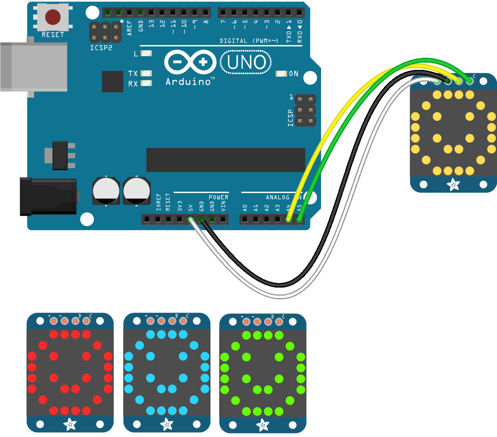

<!--remove-start-->

# LED - Matrix HT16K33

<!--remove-end-->


##### Breadboard for "LED - Matrix HT16K33"


<br>

Fritzing diagram: [docs/breadboard/led-matrix-HT16K33.fzz](breadboard/led-matrix-HT16K33.fzz)

&nbsp;


Run this example from the command line with:
```bash
node eg/led-matrix-HT16K33.js
```


```javascript
var five = require("johnny-five");
var board = new five.Board();

board.on("ready", function() {

  var heart = [
    "01100110",
    "10011001",
    "10000001",
    "10000001",
    "01000010",
    "00100100",
    "00011000",
    "00000000"
  ];

  var matrix = new five.Led.Matrix({
    addresses: [0x70],
    controller: "HT16K33",
    rotation: 3,
  });

  matrix.clear();
  matrix.draw(heart);
});

```


&nbsp;

<!--remove-start-->

## License
Copyright (c) 2012-2014 Rick Waldron <waldron.rick@gmail.com>
Licensed under the MIT license.
Copyright (c) 2015-2020 The Johnny-Five Contributors
Licensed under the MIT license.

<!--remove-end-->
