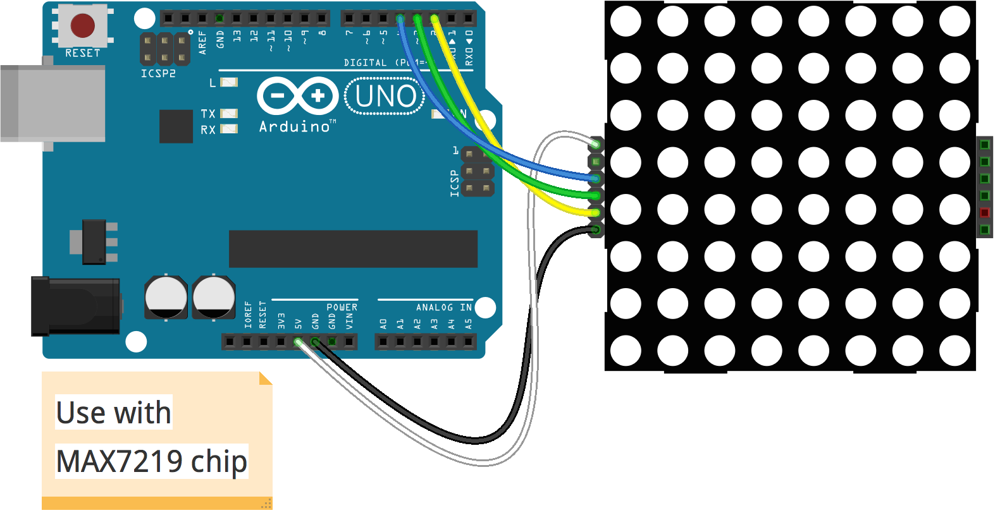

# Led Matrix

Run with:
```bash
node eg/led-matrix.js
```


```javascript
var five = require("../lib/johnny-five"),
    board, lc;

board = new five.Board();

board.on("ready", function() {
  var led = new five.Led(13);
  led.on();

  var heart = [
    "01100110",
    "10011001",
    "10000001",
    "10000001",
    "01000010",
    "00100100",
    "00011000",
    "00000000"
  ];

  lc = new five.LedControl({
    pins: {
      data: 2,
      clock: 3,
      cs: 4
    },
    devices: 1,
    isMatrix: true
  });

  function queue(fn) {
    process.nextTick( fn );
  }

  lc.heart = function() {
    heart.forEach(function(row, rowIndex) {
      queue( function() { lc.row( 0, rowIndex, parseInt( row, 2 ) ); } );
    });
  };

  lc.on( 0 );

  var msg = "johnny-five";
  var idx = 0;

  function next() {
    var c = msg[ idx ];
    lc.char( 0, c );
    idx++;
    if ( idx === msg.length ) { return; }
    setTimeout( next, 800 );
  }

  next();

  board.repl.inject({
    lc: lc
  });

});

```

## Breadboard/Illustration


[docs/breadboard/led-matrix.fzz](breadboard/led-matrix.fzz)


## Devices


## Documentation

_(Nothing yet)_


## Contributing
All contributions must adhere to the [Idiomatic.js Style Guide](https://github.com/rwldrn/idiomatic.js),
by maintaining the existing coding style. Add unit tests for any new or changed functionality. Lint and test your code using [grunt](https://github.com/cowboy/grunt).

## Release History
_(Nothing yet)_

## License
Copyright (c) 2012 Rick Waldron <waldron.rick@gmail.com>
Licensed under the MIT license.
