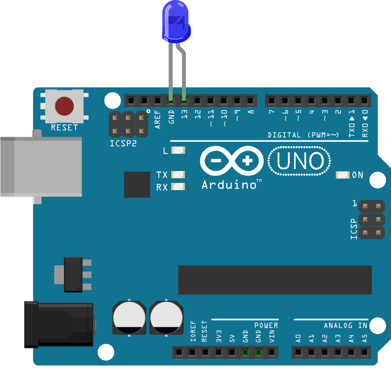

# Led Pulse

Run with:
```bash
node eg/led-pulse.js
```


```javascript
var five = require("johnny-five"),
    board, led;

board = new five.Board();

board.on("ready", function() {

  // Create a standard `led` hardware instance
  led = new five.Led({
    // Use PWM pin 9 for fading example
    pin: 9
  });

  // pinMode is set to OUTPUT by default

  // Inject the `led` hardware into
  // the Repl instance's context;
  // allows direct command line access
  board.repl.inject({
    led: led
  });

  // "pulse" the led in a looping interval
  // Interval defaults to 1000ms
  // pinMode is will be changed to PWM automatically
  led.pulse();


  // Turn off the led pulse loop after 10 seconds (shown in ms)
  this.wait( 10000, function() {

    led.stop().off();

  });
});

```

## Breadboard/Illustration




## Devices


## Documentation

_(Nothing yet)_


## Contributing
All contributions must adhere to the [Idiomatic.js Style Guide](https://github.com/rwldrn/idiomatic.js),
by maintaining the existing coding style. Add unit tests for any new or changed functionality. Lint and test your code using [grunt](https://github.com/cowboy/grunt).

## Release History
_(Nothing yet)_

## License
Copyright (c) 2012 Rick Waldron <waldron.rick@gmail.com>
Licensed under the MIT license.
