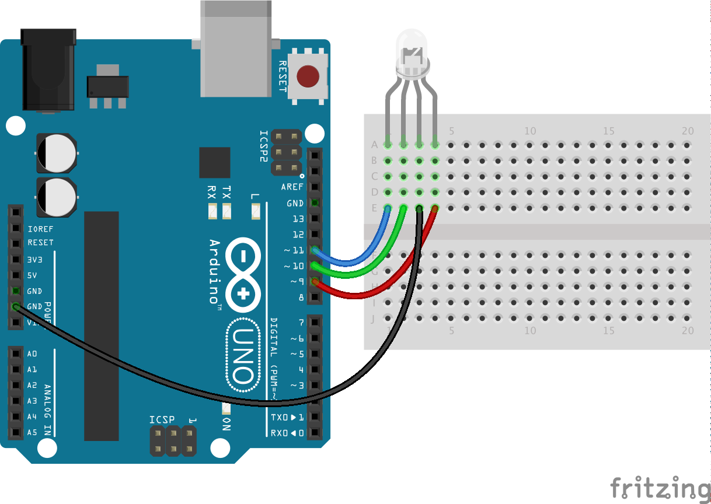

<!--remove-start-->

# LED - Rainbow

<!--remove-end-->


Demonstrates use of an RGB LED (common cathode) by cycling through rainbow colors. Requires RGB LED on pins that support PWM (usually denoted by ~).


##### Common Cathode RGB LED. (Arduino UNO)


RGB LED connected to pins 6, 5, and 3 for red, green, and blue respectively. The common pin is connected to ground.


<br>

Fritzing diagram: [docs/breadboard/led-rgb.fzz](breadboard/led-rgb.fzz)

&nbsp;


Run this example from the command line with:
```bash
node eg/led-rainbow.js
```


```javascript
const { Board, Led } = require("johnny-five");
const board = new Board();

board.on("ready", () => {
  const rgb = new Led.RGB([6, 5, 3]);
  let index = 0;
  const rainbow = ["FF0000", "FF7F00", "FFFF00", "00FF00", "0000FF", "4B0082", "8F00FF"];

  board.loop(1000, () => {
    rgb.color(rainbow[index++]);
    if (index === rainbow.length) {
      index = 0;
    }
  });
});

```


&nbsp;

<!--remove-start-->

## License
Copyright (c) 2012-2014 Rick Waldron <waldron.rick@gmail.com>
Licensed under the MIT license.
Copyright (c) 2015-2020 The Johnny-Five Contributors
Licensed under the MIT license.

<!--remove-end-->
