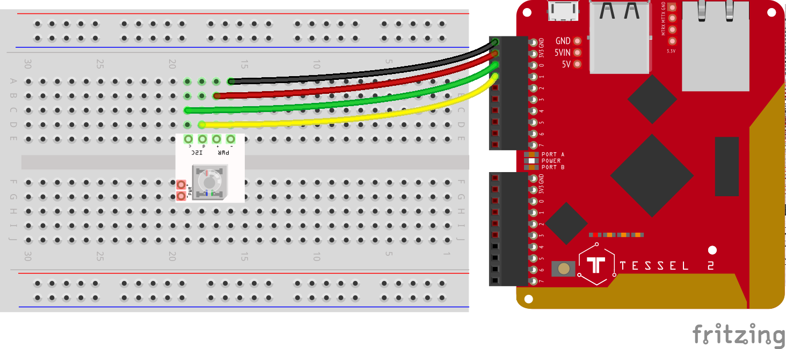

<!--remove-start-->

# LED - Rainbow BlinkM

<!--remove-end-->


Demonstrates use of a BlinkM by cycling through rainbow colors.


##### Tessel - BlinkM Basick


emonstrates use of a BlinkM, with a Tessel 2, by cycling through rainbow colors.


<br>

&nbsp;


Run this example from the command line with:
```bash
node eg/led-rgb-BLINKM.js
```


```javascript
var five = require("johnny-five");
var board = new five.Board();

board.on("ready", function() {
  // Initialize the RGB LED
  var rgb = new five.Led.RGB({
    controller: "BLINKM"
  });
  var index = 0;
  var rainbow = ["FF0000", "FF7F00", "FFFF00", "00FF00", "0000FF", "4B0082", "8F00FF"];

  this.loop(1000, function() {
    if (index + 1 === rainbow.length) {
      index = 0;
    }
    rgb.color(rainbow[index++]);
  });
});

```


&nbsp;

<!--remove-start-->

## License
Copyright (c) 2012, 2013, 2014 Rick Waldron <waldron.rick@gmail.com>
Licensed under the MIT license.
Copyright (c) 2014, 2015 The Johnny-Five Contributors
Licensed under the MIT license.

<!--remove-end-->
