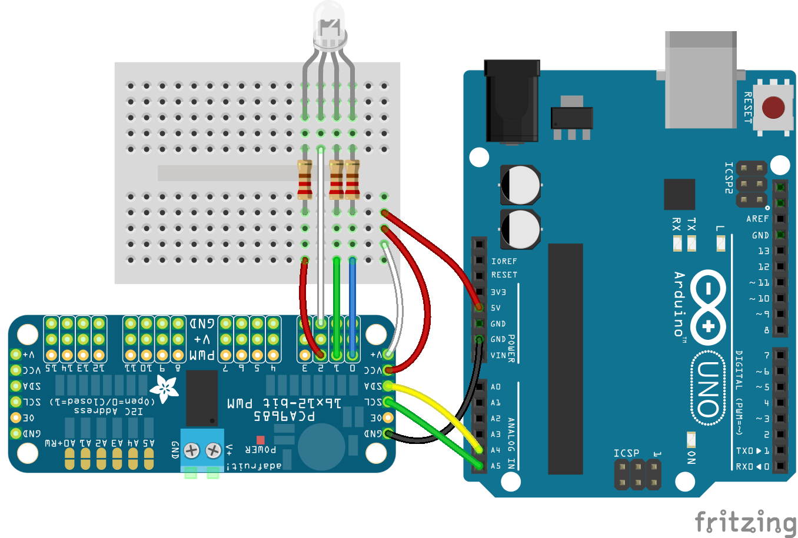

<!--remove-start-->

# LED - RGB (Common Anode) PCA9685

<!--remove-end-->


Demonstrates use of an RGB LED (common anode) with the PCA9685 controller by setting its color to red (`#ff0000`) and making it blink.


##### Breadboard for "LED - RGB (Common Anode) PCA9685"


<br>

Fritzing diagram: [docs/breadboard/led-rgb-anode-PCA9685.fzz](breadboard/led-rgb-anode-PCA9685.fzz)

&nbsp;


Run this example from the command line with:
```bash
node eg/led-rgb-anode-PCA9685.js
```


```javascript
const { Board, Led } = require("johnny-five");
const board = new Board();

board.on("ready", () => {
  // Initialize the RGB LED
  const led = new Led.RGB({
    controller: "PCA9685",
    isAnode: true,
    pins: {
      red: 2,
      green: 1,
      blue: 0
    },
  });

  // RGB LED alternate constructor
  // This will normalize an array of pins in [r, g, b]
  // order to an object (like above) that's shaped like:
  // {
  //   red: r,
  //   green: g,
  //   blue: b
  // }
  // const led = new Led.RGB({
  //   pins: [2, 1, 0],
  //   isAnode: true,
  //   controller: "PCA9685"
  // });

  // Add led to REPL (optional)
  board.repl.inject({ led });

  // Turn it on and set the initial color
  led.on();
  led.color("#FF0000");

  led.blink(1000);
});

```


&nbsp;

<!--remove-start-->

## License
Copyright (c) 2012-2014 Rick Waldron <waldron.rick@gmail.com>
Licensed under the MIT license.
Copyright (c) 2015-2020 The Johnny-Five Contributors
Licensed under the MIT license.

<!--remove-end-->
