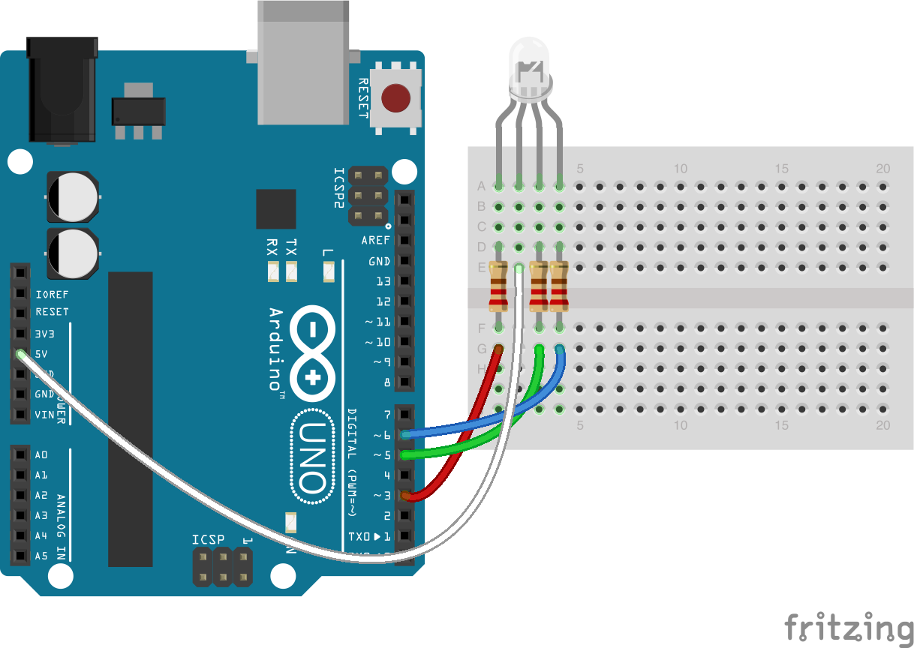

<!--remove-start-->

# LED - RGB (Common Anode)

<!--remove-end-->


Demonstrates use of an RGB LED (common anode) by setting its color to red (`#ff0000`) and making it blink. Requires RGB LED on pins that support PWM (usually denoted by ~).


##### Common Anode RGB LED. (Arduino UNO)


RGB LED connected to pins 6, 5, and 3 for red, green, and blue respectively. The common pin is connected to +5v.


<br>

Fritzing diagram: [docs/breadboard/led-rgb-anode.fzz](breadboard/led-rgb-anode.fzz)

&nbsp;


Run this example from the command line with:
```bash
node eg/led-rgb-anode.js
```


```javascript
const { Board, Led } = require("johnny-five");
const board = new Board();

board.on("ready", () => {
  const anode = new Led.RGB({
    pins: {
      red: 6,
      green: 5,
      blue: 3
    },
    isAnode: true
  });

  // Add led to REPL (optional)
  board.repl.inject({ anode });

  // Turn it on and set the initial color
  anode.on();
  anode.color("#FF0000");

  anode.blink(1000);
});

```


&nbsp;

<!--remove-start-->

## License
Copyright (c) 2012-2014 Rick Waldron <waldron.rick@gmail.com>
Licensed under the MIT license.
Copyright (c) 2015-2020 The Johnny-Five Contributors
Licensed under the MIT license.

<!--remove-end-->
