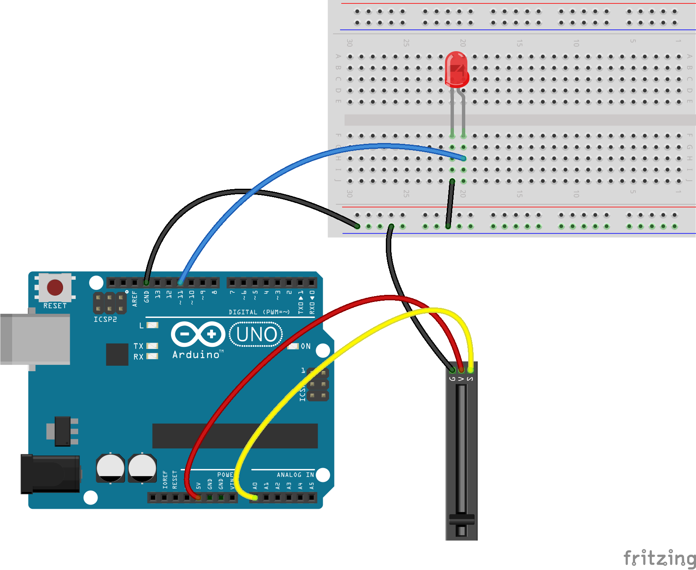

<!--remove-start-->

# LED - Slider

<!--remove-end-->


Controls the brightness of an LED by pairing it with a slider. Requires LED on pin that supports PWM (usually denoted by ~).


##### Breadboard for "LED - Slider"


<br>

Fritzing diagram: [docs/breadboard/led-slider.fzz](breadboard/led-slider.fzz)

&nbsp;


Run this example from the command line with:
```bash
node eg/led-slider.js
```


```javascript
var five = require("johnny-five");
var board = new five.Board();

board.on("ready", function() {

  var slider = new five.Sensor("A0");
  var led = new five.Led(11);

  // Scale the sensor's value to the LED's brightness range
  slider.scale([0, 255]).on("data", function() {
    led.brightness(this.value);
  });
});

```


&nbsp;

<!--remove-start-->

## License
Copyright (c) 2012, 2013, 2014 Rick Waldron <waldron.rick@gmail.com>
Licensed under the MIT license.
Copyright (c) 2018 The Johnny-Five Contributors
Licensed under the MIT license.

<!--remove-end-->
