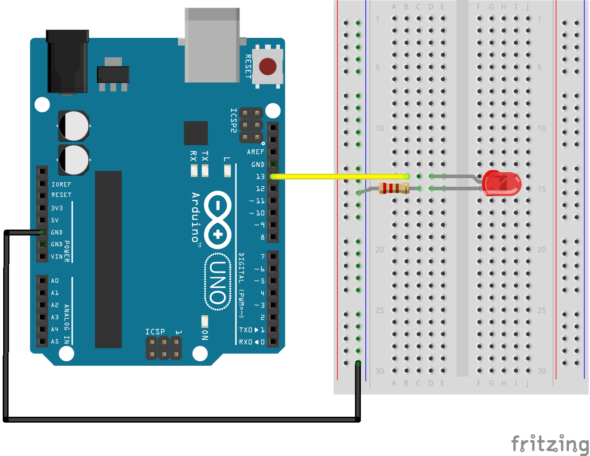

# Led

Run with:
```bash
node eg/led.js
```


```javascript
var five = require("johnny-five"),
  board = new five.Board();

board.on("ready", function() {
  // Default to pin 13
  var led = new five.Led(process.argv[2] || 13);

  this.repl.inject({
    led: led
  });

  led.blink();
});


```


## Breadboard/Illustration



[docs/breadboard/led.fzz](breadboard/led.fzz)

This script will make `led` available in the REPL, by default on pin 13.
Now you can try, e.g.:

`>> led.on()`

or

`>> led.off()`

To use other `Led` methods, like `fade`, `pulse`, `animate`, you'll need to
wire the LED to a PWM pin. If you use a different pin, make sure to run
the script with the correct pin number:

`node eg/led.js [pinNumber]`


## License
Copyright (c) 2012-2013 Rick Waldron <waldron.rick@gmail.com>
Licensed under the MIT license.
Copyright (c) 2014 The Johnny-Five Contributors
Licensed under the MIT license.
