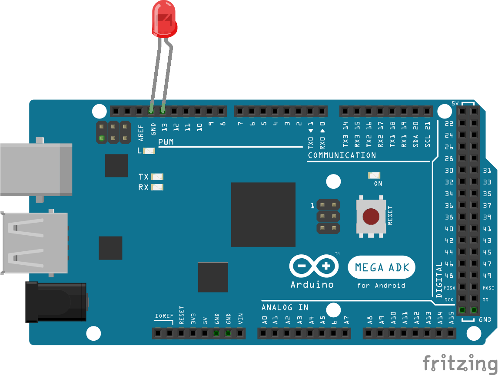

<!--remove-start-->

# LED

<!--remove-end-->


Basic LED example


##### LED on pin 13 (Arduino UNO)


LED inserted directly into pin 13


<br>

Fritzing diagram: [docs/breadboard/led-13.fzz](breadboard/led-13.fzz)

&nbsp;


Run this example from the command line with:
```bash
node eg/led.js
```


```javascript
const { Board, Led } = require("johnny-five");
const board = new Board();

board.on("ready", () => {
  const led = new Led(13);

  // This will grant access to the led instance
  // from within the REPL that's created when
  // running this program.
  board.repl.inject({
    led
  });

  led.blink();
});

```


## Illustrations / Photos


### LED on pin 13 (Arduino UNO)


LED inserted directly into pin 13


  

##### LED on pin 13 with breadboard and resistor (Arduino UNO)


LED on a breadboard and demonstrating use of a resistor


<br>

Fritzing diagram: [docs/breadboard/led-resistor.fzz](breadboard/led-resistor.fzz)

&nbsp;
##### LED on pin 13 (Arduino Mega)


LED inserted directly into pin 13


<br>

Fritzing diagram: [docs/breadboard/led-13-mega.fzz](breadboard/led-13-mega.fzz)

&nbsp;


## Additional Notes
This script will make `led` available in the REPL, by default on pin 13.
Now you can try, e.g.:
```js
>> led.stop() // to stop blinking
then
>> led.off()  // to shut it off (stop doesn't mean "off")
then
>> led.on()   // to turn on, but not blink
```

&nbsp;

<!--remove-start-->

## License
Copyright (c) 2012-2014 Rick Waldron <waldron.rick@gmail.com>
Licensed under the MIT license.
Copyright (c) 2015-2020 The Johnny-Five Contributors
Licensed under the MIT license.

<!--remove-end-->
