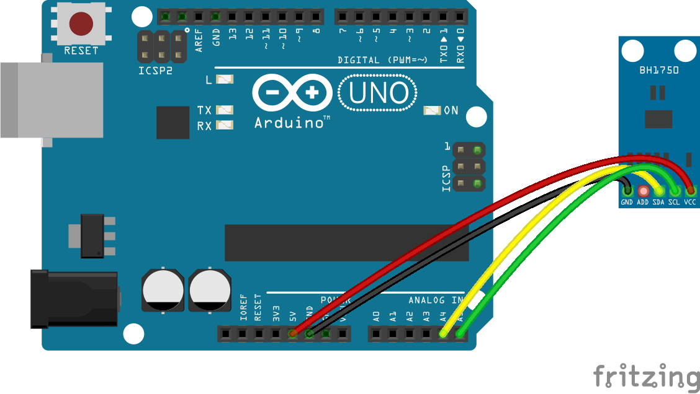
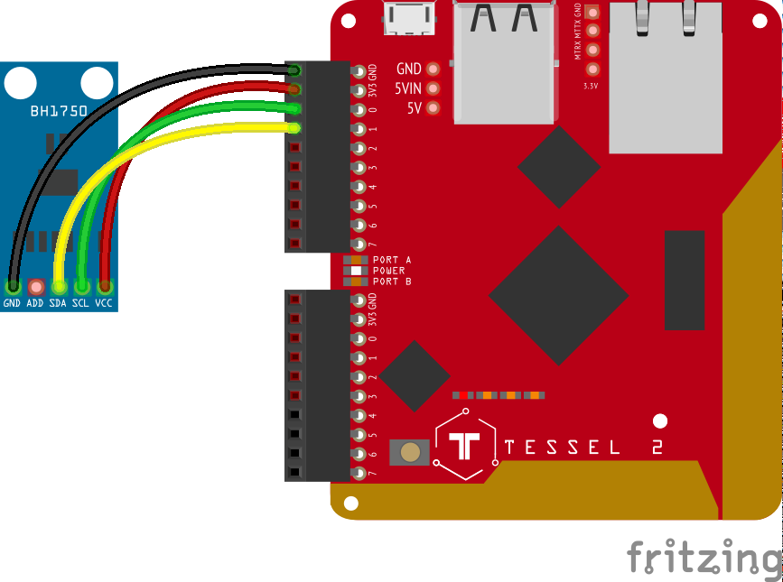

<!--remove-start-->

# Light - BH1750

<!--remove-end-->


##### BH1750 (Arduino)


<br>

Fritzing diagram: [docs/breadboard/light-ambient-BH1750-arduino.fzz](breadboard/light-ambient-BH1750-arduino.fzz)

&nbsp;


Run this example from the command line with:
```bash
node eg/light-ambient-BH1750.js
```


```javascript
const { Board, Light } = require("johnny-five");
const board = new Board();

board.on("ready", () => {
  const ambient = new Light({
    controller: "BH1750",
  });

  ambient.on("change", () => {
    console.log("Ambient Light Level: ");
    console.log("  level  : ", ambient.level);
    console.log("-----------------");
  });
});

```


## Illustrations / Photos


##### BH1750 (Tessel 2)


<br>

Fritzing diagram: [docs/breadboard/light-ambient-BH1750-tessel.fzz](breadboard/light-ambient-BH1750-tessel.fzz)

&nbsp;


&nbsp;

<!--remove-start-->

## License
Copyright (c) 2012-2014 Rick Waldron <waldron.rick@gmail.com>
Licensed under the MIT license.
Copyright (c) 2015-2020 The Johnny-Five Contributors
Licensed under the MIT license.

<!--remove-end-->
