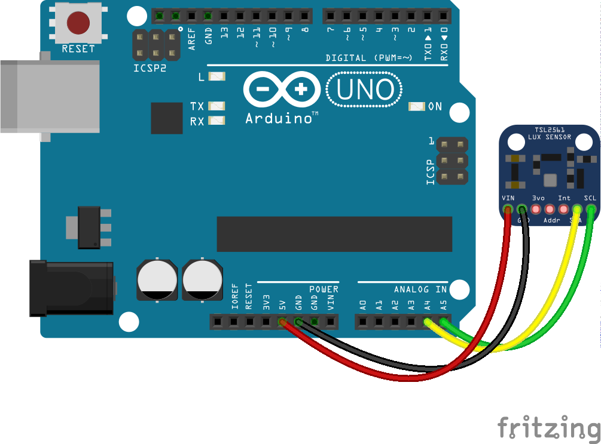

<!--remove-start-->

# Light - TSL2561

<!--remove-end-->


##### TSL2561


<br>

Fritzing diagram: [docs/breadboard/light-ambient-TSL2561.fzz](breadboard/light-ambient-TSL2561.fzz)

&nbsp;


Run this example from the command line with:
```bash
node eg/light-ambient-TSL2561.js
```


```javascript
const { Board, Light } = require("johnny-five");
const board = new Board();

board.on("ready", () => {
  const ambient = new Light({
    controller: "TSL2561",
  });

  ambient.on("change", () => {
    console.log("Ambient Light Level: ");
    console.log("  level  : ", ambient.level);
    console.log("-----------------");
  });
});

```


&nbsp;

<!--remove-start-->

## License
Copyright (c) 2012-2014 Rick Waldron <waldron.rick@gmail.com>
Licensed under the MIT license.
Copyright (c) 2015-2020 The Johnny-Five Contributors
Licensed under the MIT license.

<!--remove-end-->
