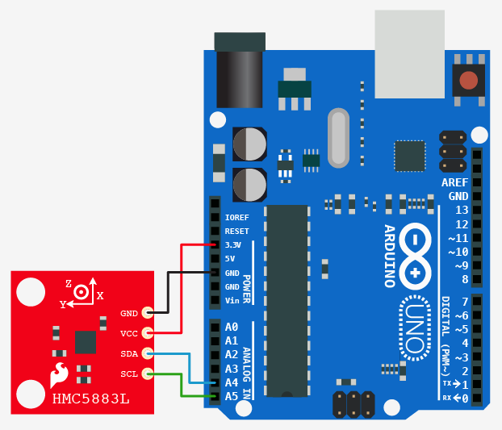

<!--remove-start-->

# Compass / Magnetometer

<!--remove-end-->


##### Breadboard for "Compass / Magnetometer"


<br>

&nbsp;


Run this example from the command line with:
```bash
node eg/magnetometer.js
```


```javascript
var five = require("johnny-five");
var board = new five.Board();

board.on("ready", function() {

  // Create a new `Magnetometer` hardware instance.
  //
  // five.Magnetometer();
  //
  // (Alias of:
  //   new five.Compass({
  //    controller: "HMC5883L",
  //    freq: 50,
  //    gauss: 1.3
  //   });
  // )
  //

  var magnetometer = new five.Magnetometer();


  // Properties

  // mag.raw
  //
  // x, y, z
  //

  // mag.scaled
  //
  // axis x, y, z
  //
  // based on value stored at (mag.scale)
  //

  // mag.heading
  //
  // Calculated heading in degrees (calibrated for magnetic north)
  //

  // mag.bearing
  //
  // Bearing data object
  //


  // Magnetometer Event API

  // "headingchange"
  //
  // Fires when the calculated heading has changed
  //
  magnetometer.on("headingchange", function() {

    console.log("heading", Math.floor(this.heading));
    // console.log("bearing", this.bearing);

  });
});

```


&nbsp;

<!--remove-start-->

## License
Copyright (c) 2012-2014 Rick Waldron <waldron.rick@gmail.com>
Licensed under the MIT license.
Copyright (c) 2015-2020 The Johnny-Five Contributors
Licensed under the MIT license.

<!--remove-end-->
