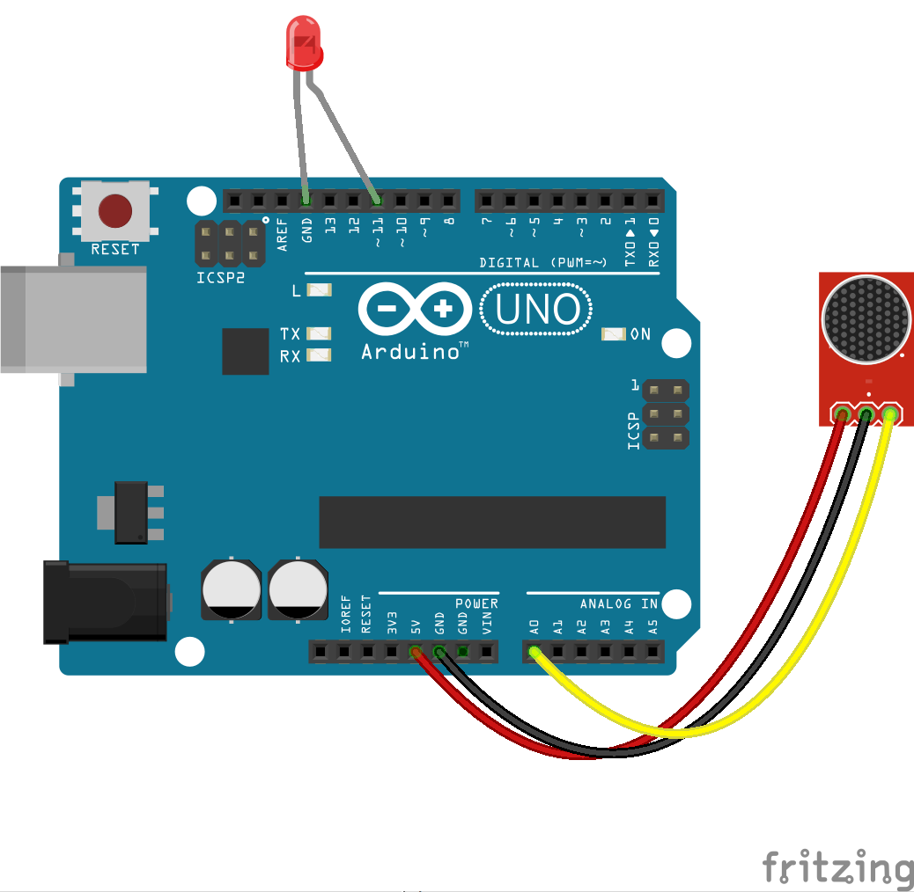

<!--remove-start-->

# Sensor - Microphone

<!--remove-end-->


##### Breadboard for "Sensor - Microphone"


<br>

Fritzing diagram: [docs/breadboard/microphone.fzz](breadboard/microphone.fzz)

&nbsp;


Run this example from the command line with:
```bash
node eg/microphone.js
```


```javascript
var five = require("johnny-five");
var board = new five.Board();

board.on("ready", function() {
  var mic = new five.Sensor("A0");
  var led = new five.Led(11);

  mic.on("data", function() {
    led.brightness(this.value >> 2);
  });
});

```


&nbsp;

<!--remove-start-->

## License
Copyright (c) 2012-2014 Rick Waldron <waldron.rick@gmail.com>
Licensed under the MIT license.
Copyright (c) 2015-2020 The Johnny-Five Contributors
Licensed under the MIT license.

<!--remove-end-->
