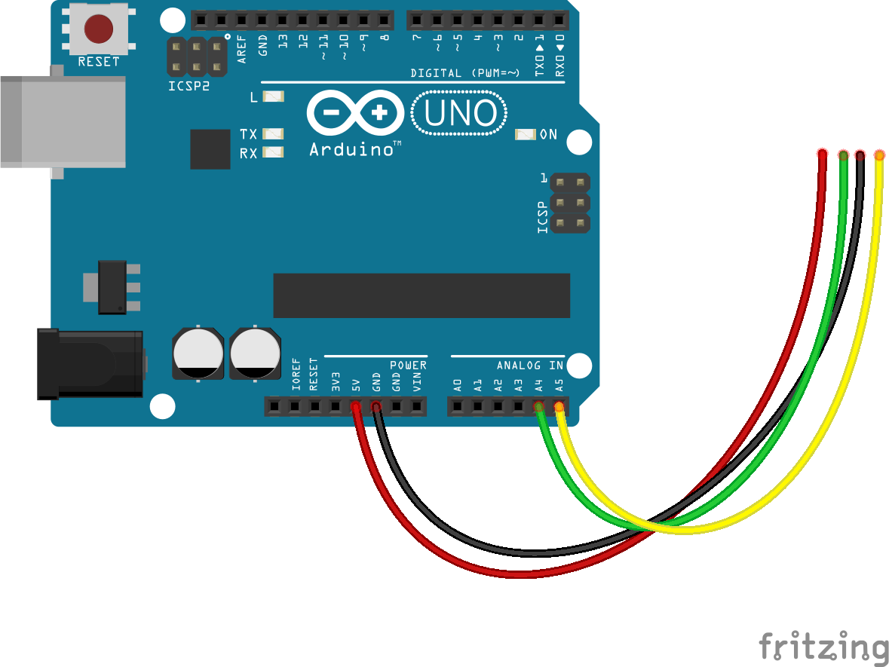

<!--remove-start-->

# Motion - GP2Y0D805Z0F

<!--remove-end-->


Motion detection with GP2Y0D805Z0F sensor.


##### Breadboard for "Motion - GP2Y0D805Z0F"


<br>

Fritzing diagram: [docs/breadboard/motion-gp2y0d805z0f.fzz](breadboard/motion-gp2y0d805z0f.fzz)

&nbsp;


Run this example from the command line with:
```bash
node eg/motion-gp2y0d805z0f.js
```


```javascript
var five = require("johnny-five");
var board = new five.Board();

board.on("ready", function() {

  // Create a new `motion` hardware instance.
  var motion = new five.Motion({
    controller: "GP2Y0D805Z0F"
  });

  // "calibrated" occurs once, at the beginning of a session,
  motion.on("calibrated", function() {
    console.log("calibrated");
  });

  // "motionstart" events are fired when the "calibrated"
  // proximal area is disrupted, generally by some form of movement
  motion.on("motionstart", function() {
    console.log("motionstart");
  });

  // "motionend" events are fired following a "motionstart" event
  // when no movement has occurred in X ms
  motion.on("motionend", function() {
    console.log("motionend");
  });

  // "data" events are fired at the interval set in opts.freq
  // or every 25ms. Uncomment the following to see all
  // motion detection readings.
  // motion.on("data", function(data) {
  //   console.log(data);
  // });
});

```


&nbsp;

<!--remove-start-->

## License
Copyright (c) 2012-2014 Rick Waldron <waldron.rick@gmail.com>
Licensed under the MIT license.
Copyright (c) 2015-2020 The Johnny-Five Contributors
Licensed under the MIT license.

<!--remove-end-->
