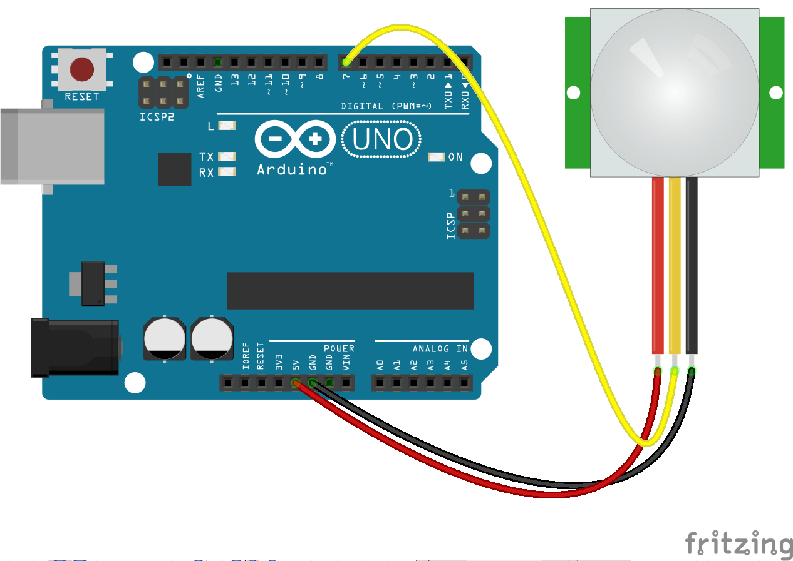

<!--remove-start-->

# Motion


Basic infrared Motion example


Run with:
```bash
node eg/motion.js
```

<!--remove-end-->

```javascript
var five = require("johnny-five");
var board = new five.Board();

board.on("ready", function() {

  // Create a new `motion` hardware instance.
  var motion = new five.Motion(7);

  // "calibrated" occurs once, at the beginning of a session,
  motion.on("calibrated", function() {
    console.log("calibrated");
  });

  // "motionstart" events are fired when the "calibrated"
  // proximal area is disrupted, generally by some form of movement
  motion.on("motionstart", function() {
    console.log("motionstart");
  });

  // "motionend" events are fired following a "motionstart" event
  // when no movement has occurred in X ms
  motion.on("motionend", function() {
    console.log("motionend");
  });

  // "data" events are fired at the interval set in opts.freq
  // or every 25ms
  motion.on("data", function(data) {
    console.log(data);
  });
});

```


## Illustrations / Photos


### Breadboard for "Motion"


<br>

Fritzing diagram: [docs/breadboard/motion.fzz](breadboard/motion.fzz)

&nbsp;


&nbsp;

<!--remove-start-->

## License
Copyright (c) 2012, 2013, 2014 Rick Waldron <waldron.rick@gmail.com>
Licensed under the MIT license.
Copyright (c) 2014, 2015 The Johnny-Five Contributors
Licensed under the MIT license.

<!--remove-end-->
