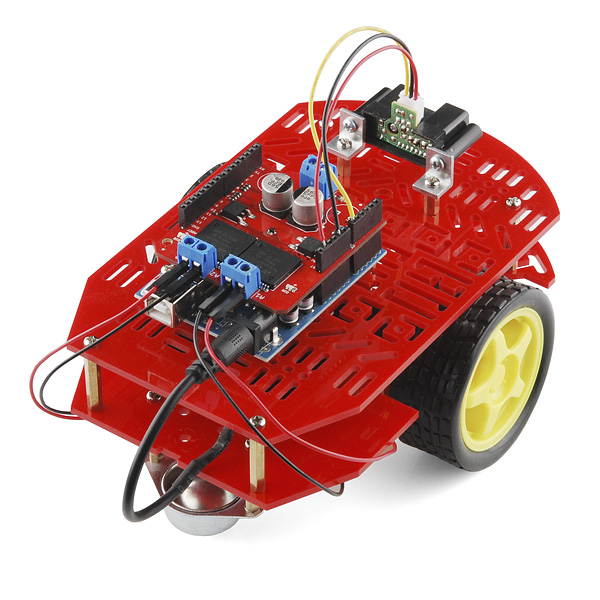
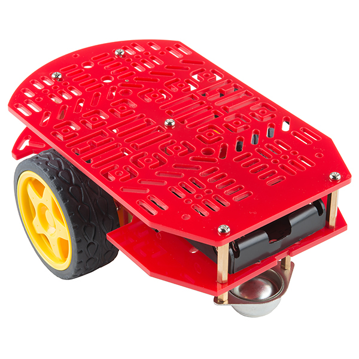

<!--remove-start-->

# Motobot

<!--remove-end-->


Run this example from the command line with:
```bash
node eg/motobot.js
```


```javascript
const {Board, Motor, Fn} = require("johnny-five");
const keypress = require("keypress");
const board = new Board();

board.on("ready", () => {
  let speed = 100;
  let commands = null;
  const motors = {
    a: new Motor([3, 12]),
    b: new Motor([11, 13])
  };

  board.repl.inject({
    motors
  });

  function controller(ch, key) {
    if (key) {
      if (key.name === "space") {
        motors.a.stop();
        motors.b.stop();
      }
      if (key.name === "up") {
        motors.a.rev(speed);
        motors.b.fwd(speed);
      }
      if (key.name === "down") {
        motors.a.fwd(speed);
        motors.b.rev(speed);
      }
      if (key.name === "right") {
        motors.a.fwd(speed * 0.75);
        motors.b.fwd(speed * 0.75);
      }
      if (key.name === "left") {
        motors.a.rev(speed * 0.75);
        motors.b.rev(speed * 0.75);
      }

      commands = Array.from(arguments);
    } else {
      if (ch >= 1 && ch <= 9) {
        speed = Fn.scale(ch, 1, 9, 0, 255);
        controller(...commands);
      }
    }
  }


  keypress(process.stdin);

  process.stdin.on("keypress", controller);
  process.stdin.setRawMode(true);
  process.stdin.resume();
});


```


## Illustrations / Photos


### Complete Motobot


Typical complete Motobot platform


  

### Motobot chassis


Motobot chassis before addings


  


## Additional Notes


&nbsp;

<!--remove-start-->

## License
Copyright (c) 2012-2014 Rick Waldron <waldron.rick@gmail.com>
Licensed under the MIT license.
Copyright (c) 2015-2020 The Johnny-Five Contributors
Licensed under the MIT license.

<!--remove-end-->
